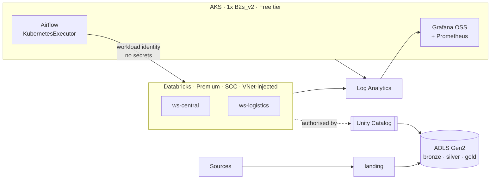

# YODA Data Platform

An Azure- and Databricks-based data platform, built as Terraform modules and
deployed through CI — infrastructure, governance, orchestration, observability
and the automation that operates it.

Built to the PostNord *Platform Engineer (Infra), Data Platform Team* brief:
Azure infrastructure, Databricks administration, Airflow, Terraform, Kubernetes,
CI/CD, networking, security and compliance, Entra/IAM, observability, platform
reliability, and FinOps — plus the West Europe → Sweden Central migration
strategy for the YODA Central Data Platform.

**This is applied, not illustrative.** The `sandbox` environment runs against a
real Azure subscription with a 4 vCPU regional quota and a spending limit. That
constraint shaped the design and is documented rather than hidden.

---

## What it looks like



Full detail: **[docs/ARCHITECTURE.md](docs/ARCHITECTURE.md)**

---

## The constraint that shaped everything

| | |
|---|---|
| Regional quota | **4 vCPU**, Sweden Central |
| Subscription | Free Trial, spending limit **on** — services disable rather than bill |
| Budget | ~EUR 50/month |

| Component | vCPU | Where it runs |
|---|---:|---|
| AKS system pool (1–2 × `Standard_B2s_v2`) | 2–4 | This subscription |
| Databricks SQL warehouse + jobs (serverless) | **0** | Databricks' subscription |

Serverless Databricks compute is why a data platform and a Kubernetes cluster
fit inside four cores. Classic VNet-injected compute needs a 4-vCPU node — the
entire quota — so one interactive cluster would leave nothing for Airflow. The
classic path is fully built in Terraform and gated behind one variable
([ADR-003](docs/DECISIONS.md#adr-003)).

---

## Quick start

**Prerequisites:** `terraform >= 1.9`, `az`, `kubectl`, `helm`, `jq`, `python3`.
Azure `Owner` on the subscription, plus `Groups Administrator` in Entra to
create the access groups.

```bash
az login

make bootstrap                      # state containers + CI federated identity (once)
make backend-config ENV=sandbox
make tfvars       ENV=sandbox       # fills subscription, tenant and your public IP
make quota        ENV=sandbox       # will this fit? answers in 2s, not 12min

make plan  ENV=sandbox
make apply ENV=sandbox

./scripts/bash/check-metastore.sh sandbox
make plan  ENV=sandbox-databricks   # Unity Catalog, cluster policies, warehouse
make apply ENV=sandbox-databricks

make kubeconfig      ENV=sandbox
make platform-deploy ENV=sandbox    # Airflow, Prometheus, Grafana
```

**Cost control — this environment bills by the hour:**

```bash
make stop    ENV=sandbox   # park the cluster overnight, keep all state
make start   ENV=sandbox
make cost    ENV=sandbox   # month-to-date, attributed by tag
make destroy ENV=sandbox   # remove everything
```

---

## Repository layout

```
terraform/
  bootstrap/                 remote state + CI federated identity (run once)
  modules/                   network · data-lake · identity · observability
                             governance · platform-services · databricks-workspace
                             unity-catalog · databricks-compute · aks-platform
  envs/sandbox/              applied: foundation, workspaces, AKS
  envs/sandbox-databricks/   applied: Unity Catalog, policies, SQL warehouse
  envs/prod/                 code-complete reference, deliberately not applied

kubernetes/                  Airflow, kube-prometheus-stack, NetworkPolicy
docker/airflow/              custom image — Databricks + Azure providers
dags/                        Airflow DAGs, baked into the image (ADR-014)
scripts/                     quota preflight, FinOps report, UC drift detection
.github/workflows/           CI
azure-pipelines/             the same CI on Azure DevOps
docs/                        architecture, ADRs, migration, DR, runbooks
```

---

## Design positions worth arguing with

Each is an ADR with a cost and a revisit trigger — [docs/DECISIONS.md](docs/DECISIONS.md).

| | Decision |
|---|---|
| [003](docs/DECISIONS.md#adr-003) | Serverless-first Databricks — the only way this fits in 4 vCPU |
| [005](docs/DECISIONS.md#adr-005) | No secret exists anywhere. Federation for CI, pods and Unity Catalog |
| [006](docs/DECISIONS.md#adr-006) | A workspace per domain — because the workspace, not the catalog, is the cost and policy boundary |
| [008](docs/DECISIONS.md#adr-008) | Two Terraform roots — the `databricks` provider host cannot depend on a resource in the same apply |
| [009](docs/DECISIONS.md#adr-009) | Alerts fire on symptoms. Nothing pages on CPU |
| [011](docs/DECISIONS.md#adr-011) | Grafana OSS in-cluster instead of ~EUR 45/month Managed Grafana |
| [012](docs/DECISIONS.md#adr-012) | Unity Catalog is the only authorisation point. No human holds storage RBAC |

---

## Security posture

| Control | Implementation |
|---|---|
| No stored credentials | OIDC federation for CI, workload identity for pods, Access Connector for Unity Catalog |
| Storage keys | `shared_access_key_enabled = false` — the credential does not exist |
| Data authorisation | Unity Catalog grants only, always to Entra groups, never to users |
| Cluster network | Secure Cluster Connectivity, no public IPs, VNet-injected, default-deny NSGs |
| Kubernetes | Entra RBAC, `local_account_disabled`, Pod Security `restricted`, Cilium default-deny |
| Guardrails | Azure Policy baseline: TLS floor, no public blob, Databricks must be Premium + SCC |
| Audit | Databricks, storage, Key Vault and AKS diagnostics → Log Analytics |

Detail: [docs/SECURITY.md](docs/SECURITY.md) ·
[docs/NETWORK-CIA.md](docs/NETWORK-CIA.md)

---

## Documentation

| Document | Answers |
|---|---|
| [SOLUTION-DESIGN.md](docs/SOLUTION-DESIGN.md) | Design-authority view: context, requirements, NFRs, risks, roadmap |
| [TECH-STACK.md](docs/TECH-STACK.md) | Every Azure service and tool: what, why, and what was rejected instead |
| [ARCHITECTURE.md](docs/ARCHITECTURE.md) | What the platform is and how data flows |
| [ARCHITECTURE-VISUAL.md](docs/ARCHITECTURE-VISUAL.md) | Top-to-bottom service view; links the iconographic rendering |
| [DECISIONS.md](docs/DECISIONS.md) | Why each choice, what it cost, when to revisit |
| [NETWORK-CIA.md](docs/NETWORK-CIA.md) | Network design against Confidentiality, Integrity, Availability |
| [SECURITY.md](docs/SECURITY.md) | Identity, encryption, compliance control mapping |
| [MIGRATION-YODA.md](docs/MIGRATION-YODA.md) | West Europe → Sweden Central, cutover and rollback |
| [DR.md](docs/DR.md) | RTO/RPO, failure modes, recovery |
| [OBSERVABILITY.md](docs/OBSERVABILITY.md) | SLOs, dashboards, alerting philosophy |
| [FINOPS.md](docs/FINOPS.md) | Cost model, attribution, the levers that work |
| [RUNBOOKS.md](docs/RUNBOOKS.md) | Incident response — every alert links here |
| [TROUBLESHOOTING.md](docs/TROUBLESHOOTING.md) | Symptom-first diagnostics: "X is broken, how do I fix it" |
| [ACCESS.md](docs/ACCESS.md) | How to reach every UI and API, and why none is public |
| [MCP.md](docs/MCP.md) | MCP servers configured, and why only three |
| [CI-STANDARDS.md](docs/CI-STANDARDS.md) | What runs on a PR, action pinning policy, config-parity rule |
| [ONBOARDING-DOMAIN.md](docs/ONBOARDING-DOMAIN.md) | Adding a data domain |
| [COVERAGE.md](docs/COVERAGE.md) | Requirement → artefact traceability |
| [BUILD-LOG.md](docs/BUILD-LOG.md) | How it was built: decisions, 18 failures found by applying, what changed |

---

## Verification

```bash
make check ENV=sandbox   # everything CI runs, in CI order
```

`fmt-check` · `tflint` · `terraform validate` (all roots) · `trivy config`
(CRITICAL blocks) · Databricks cluster-policy contract · Airflow DAG import
check · documentation link and ADR-anchor check.

CI runs the same targets on GitHub Actions and Azure DevOps. The Azure-dependent
stages skip cleanly until `terraform/bootstrap` has been applied and its outputs
recorded as repository variables — the pipeline is green on first commit.
