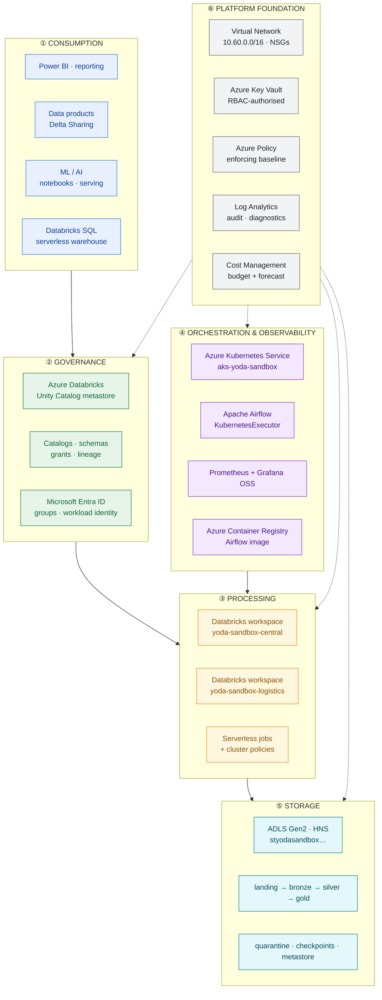
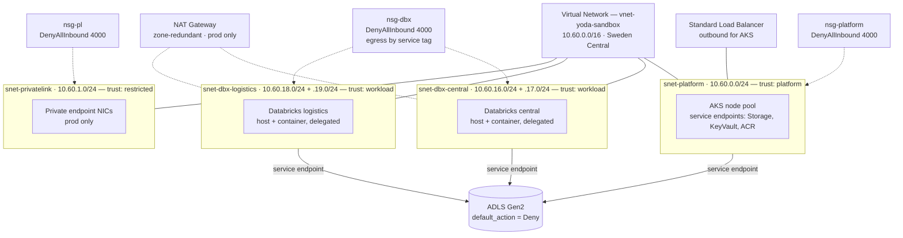
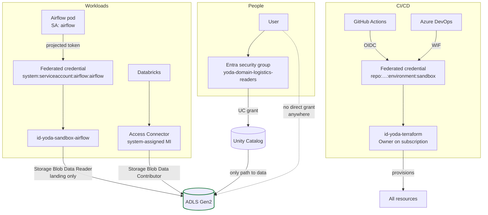
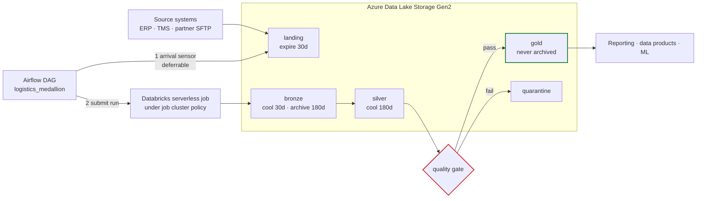
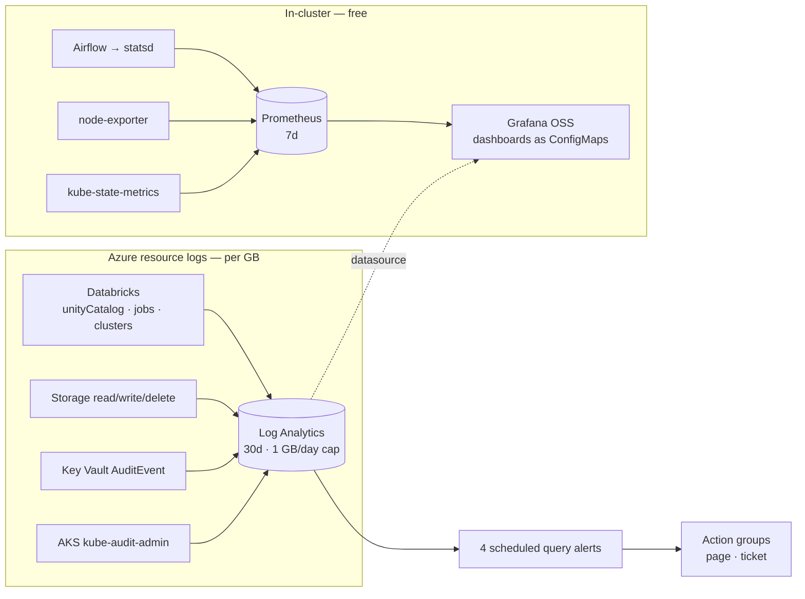
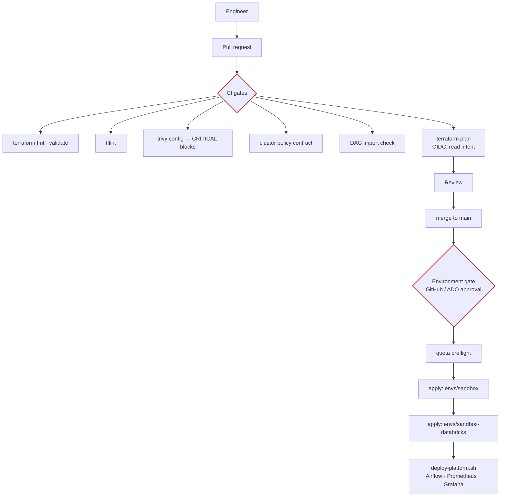

# Architecture — visual reference

Top-to-bottom service view of the YODA Data Platform, from consumers down to
the platform foundation, with the concrete Azure resource behind every box.

**Rendering note.** GitHub's Mermaid renderer cannot load external icon packs,
so these diagrams name services rather than drawing their icons. A fully
iconographic rendering of the same architecture is published separately — see
[§7](#7-iconographic-rendering).

Companion documents: [ARCHITECTURE.md](ARCHITECTURE.md) for flows and rationale,
[SOLUTION-DESIGN.md](SOLUTION-DESIGN.md) for the design-authority view.

---

## 1. Layered view — top to bottom

| Layer | Azure service | Deployed resource |
|---|---|---|
| ① Consumption | Databricks SQL (serverless) | 2 warehouses, 2X-Small, 10-min auto-stop |
| ② Governance | Unity Catalog · Entra ID | `metastore_azure_swedencentral`, 2 catalogs, 5 groups |
| ③ Processing | Azure Databricks Premium | 2 VNet-injected workspaces, SCC, 4 cluster policies |
| ④ Orchestration | AKS · ACR | 1.34 Free tier, 1× `Standard_B2s_v2`, ACR Basic |
| ⑤ Storage | ADLS Gen2 | HNS, 7 containers, lifecycle tiering |
| ⑥ Foundation | VNet · Key Vault · Policy · Log Analytics · Budgets | 6 subnets, 3 NSGs, enforcing baseline, 1 GB/day cap |

---

## 2. Network topology

Databricks egress is allowed by **service tag**, not address range, so the rules
survive Azure re-IPing its own services:

| Priority | Destination | Port | Purpose |
|---|---|---|---|
| 200 | `VirtualNetwork` | any | Worker-to-worker (Spark shuffle) |
| 210 | `AzureDatabricks` | 443 | Control plane + SCC tunnel |
| 220 | `Sql` | 3306 | Legacy Hive metastore |
| 230 | `Storage` | 443 | The lake |
| 240 | `EventHub` | 9093 | Log and metric delivery |
| 250 | `AzureActiveDirectory` | 443 | Token acquisition |
| 4000 | any | any | **Deny** — inbound always; outbound when strict egress on |

Full rationale, including what each control defends and how it fails:
[NETWORK-CIA.md](NETWORK-CIA.md).

---

## 3. Identity and trust chain

**No secret exists at any point in this chain.** Everything is a federated or
managed identity. `shared_access_key_enabled = false` removes the storage key
entirely — see [SECURITY.md](SECURITY.md).

---

## 4. Data flow with the services that move it

The gate sits **between silver and gold**, not after gold: publishing a bad
table and alerting afterwards means consumers have already read it.

---

## 5. Observability signal paths

The split is by **signal origin, not preference**: Azure resource logs exist
only in Log Analytics and Prometheus cannot see them; pod metrics do not belong
in a per-GB log store. See [OBSERVABILITY.md](OBSERVABILITY.md).

---

## 6. Deployment and promotion path

Order is enforced, not conventional: `sandbox-databricks` reads `sandbox`'s
outputs from remote state ([ADR-008](DECISIONS.md#adr-008)). Destroy reverses it.

---

## 7. Iconographic rendering

A rendering of this architecture using Azure service iconography — drawn in
Azure's visual language, laid out top-to-bottom across the six layers — is
published as a standalone page:

**[View the iconographic architecture](https://claude.ai/code/artifact/d7b717e1-acaf-4491-b4b2-2cf964fbf177)**

Source: [`architecture-visual.html`](architecture-visual.html) in this
directory. It is the version to use in a design review or a slide; the Mermaid
diagrams above are the version that stays correct in a pull request diff.

> **Icon provenance.** The published page uses SVG drawn to resemble the Azure
> service iconography, not Microsoft's official icon files. The official set is
> distributed by Microsoft under terms permitting use in architecture diagrams
> and can be substituted directly — each shape is a discrete `<symbol>` in the
> page source. Do not represent the drawn icons as Microsoft's own assets.
