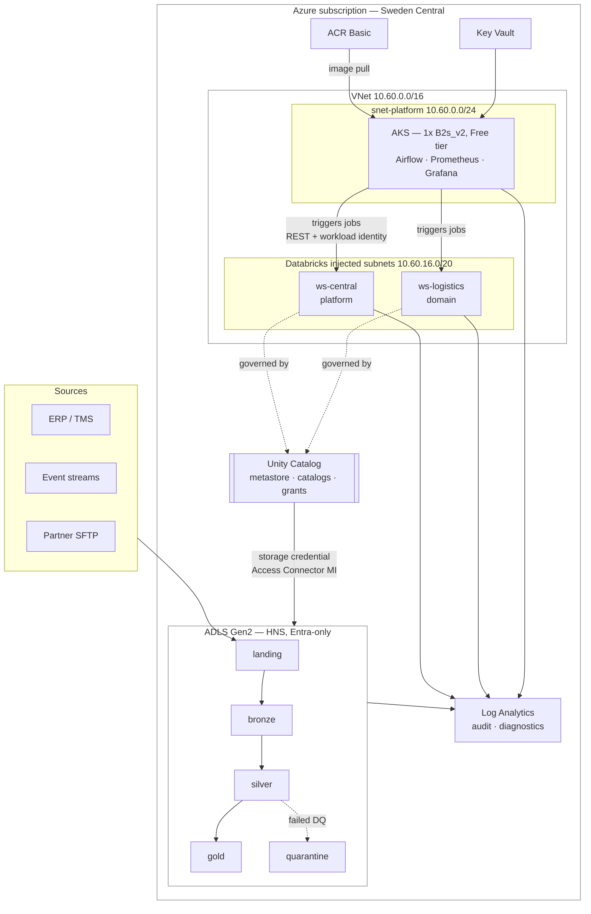
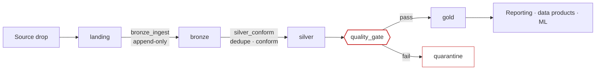
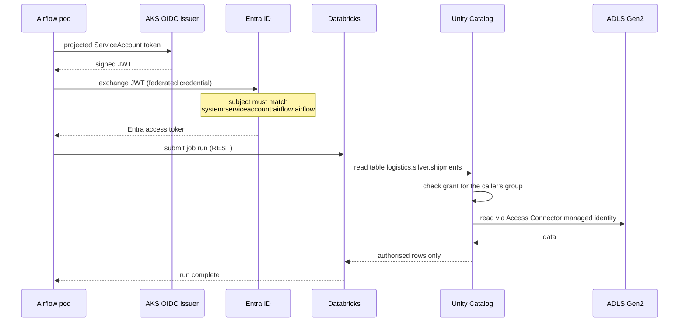
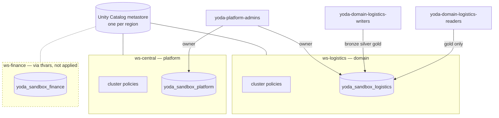

# Architecture

The YODA data platform: an Azure- and Databricks-based platform for analytics,
AI, reporting and data-product development, built as Terraform modules and
deployed through CI.

This document describes what the platform is and why it has this shape.
Decisions with a cost attached live in [DECISIONS.md](DECISIONS.md); the
network's security rationale is in [NETWORK-CIA.md](NETWORK-CIA.md).

---

## 1. The shape in one picture



**The load-bearing idea.** Airflow orchestrates, Databricks computes, Unity
Catalog authorises. No component does two of those jobs. That separation is
what lets the orchestration layer run on 2 vCPU while the data layer scales
independently — and it is what makes "who read this table" answerable, because
every read goes through one authorisation point that logs it.

---

## 2. Compute topology and why it fits in 4 vCPU

The subscription has a **4 vCPU regional quota in Sweden Central**. That single
number determined most of the design.

| Component | vCPU consumed | Where it runs |
|---|---:|---|
| AKS system pool (1–2 × `Standard_B2s_v2`) | 2–4 | This subscription |
| Databricks SQL warehouse (serverless) | **0** | Databricks' subscription |
| Databricks jobs (serverless) | **0** | Databricks' subscription |
| **Ceiling** | **4** | |

Serverless Databricks compute is the reason a data platform and a Kubernetes
cluster coexist inside four cores. Classic (VNet-injected) compute needs a
4-vCPU node minimum — the entire quota — so a single interactive cluster would
leave nothing for Airflow.

The classic path is still fully built: injected subnets, NSG rules, cluster
policies and the NAT gateway for egress all exist in code, gated behind
`enable_nat_gateway`. Turning it on is one variable, and
`scripts/bash/check-quota.sh` will tell you it does not fit before Terraform
finds out twelve minutes into an apply.

---

## 3. Data flow: medallion, with a gate before publication



| Layer | Contract | Who can read it |
|---|---|---|
| `landing` | none — raw source bytes | ingest job only |
| `bronze` | append-only history, schema-on-read | domain writers |
| `silver` | conformed, deduplicated entities | domain writers |
| `gold` | **published interface**, stable schema | domain readers, analysts |
| `quarantine` | rows that failed a check, held for inspection | platform admins |

**Why the gate sits between silver and gold, not after gold.** Publishing a bad
table and alerting afterwards means consumers have already read it. Gold is the
published interface precisely because it is the layer something is checked
before entering. Failed rows go to `quarantine` rather than being dropped, so a
failure can be investigated rather than merely counted.

---

## 4. Access path: nothing holds a key



Four properties fall out of this chain:

1. **No secret exists to leak.** The pod holds a short-lived projected token,
   not a credential. `shared_access_key_enabled = false` on the lake removes the
   storage key entirely.
2. **No human holds storage RBAC.** Only the Access Connector managed identity
   has data-plane access. Every human read is brokered by Unity Catalog.
3. **Every read is logged** in the Unity Catalog audit log, shipped to Log
   Analytics — which is what makes an access review possible at all.
4. **The federation subject is namespace- and ServiceAccount-scoped**, so
   compromising the Grafana pod does not yield Airflow's access to Databricks.

---

## 5. Domain isolation: why a workspace per domain



A single workspace with catalogs for isolation would have been cheaper to
operate. It was rejected because **a workspace — not a catalog — is the boundary
for three things that matter**: cluster policies, workspace administrators, and
the DBU line on the bill. Domains sharing a workspace share all three, and
"which domain spent this" stops having an answer.

Adding a domain is a documented, four-step change —
[ONBOARDING-DOMAIN.md](ONBOARDING-DOMAIN.md).

---

## 6. Repository layout

```
terraform/
  bootstrap/                 state containers + CI federated identity (run once)
  modules/
    network/                 VNet, delegated subnets, NSGs, egress, private DNS
    data-lake/               ADLS Gen2, medallion containers, lifecycle rules
    identity/                Entra groups, workload identities, RBAC
    observability/           Log Analytics, action groups, symptom alerts
    governance/              Azure Policy baseline, budget
    platform-services/       Key Vault, container registry
    databricks-workspace/    VNet-injected Premium workspace + Access Connector
    unity-catalog/           storage credential, external locations, catalog, grants
    databricks-compute/      cluster policies, serverless SQL warehouse
    aks-platform/            AKS, workload identity federation
  envs/
    sandbox/                 deployed: foundation + workspaces + AKS
    sandbox-databricks/      deployed: Unity Catalog + compute policy (2nd root)
    prod/                    code-complete reference, deliberately not applied

kubernetes/                  Airflow, kube-prometheus-stack, namespaces + NetworkPolicy
docker/airflow/              custom image: Databricks + Azure providers
dags/                        Airflow DAGs, baked into the image
scripts/                     quota preflight, FinOps report, drift detection
.github/workflows/           CI
azure-pipelines/             the same CI on Azure DevOps (ADR-013)
docs/                        this
```

**Why two Terraform roots.** The `databricks` provider needs a `host`, which is
the workspace URL, which does not exist until the workspace is created — and
Terraform must configure every provider before building the graph. The second
root reads the first's outputs through a remote state data source, so CI runs
them in order without anyone remembering a `-target` flag. See
[ADR-008](DECISIONS.md#adr-008).

---

## 7. What is deployed versus what is code-complete

Being explicit about this matters more than the diagram: a reference
architecture that has never been applied hides its own mistakes.

| | sandbox (applied) | prod (code, not applied) |
|---|---|---|
| VNet, NSGs, delegated subnets | yes | yes |
| ADLS Gen2, medallion, lifecycle | yes | yes |
| Databricks Premium, SCC, VNet injection | yes | yes |
| Unity Catalog, catalogs, grants | yes | yes |
| Cluster policies, serverless warehouse | yes | yes |
| Azure Policy baseline, budget | yes | yes |
| Audit diagnostics to Log Analytics | yes | yes |
| AKS + Airflow + Grafana | yes | yes |
| Private endpoints + private DNS | no | yes |
| NAT gateway, strict egress | no | yes |
| Customer-managed keys | no | yes |
| Zone-redundant storage | no (LRS) | yes (ZRS) |
| Postgres Flexible Server for Airflow | no (in-cluster) | yes |
| Defender for Storage / Containers | no | yes |

Everything in the "no" column is a variable, not missing code. The cost of
turning each one on is tabulated in the header of
`terraform/envs/sandbox/main.tf`.

---

## 8. Related documents

| Document | Answers |
|---|---|
| [DECISIONS.md](DECISIONS.md) | Why each choice, what it cost, when to revisit |
| [NETWORK-CIA.md](NETWORK-CIA.md) | Network design against Confidentiality, Integrity, Availability |
| [SECURITY.md](SECURITY.md) | Identity, encryption, compliance control mapping |
| [MIGRATION-YODA.md](MIGRATION-YODA.md) | West Europe → Sweden Central cutover and rollback |
| [DR.md](DR.md) | RTO/RPO, failure modes, recovery procedures |
| [OBSERVABILITY.md](OBSERVABILITY.md) | SLOs, dashboards, why alerts fire on symptoms |
| [FINOPS.md](FINOPS.md) | Cost model, attribution, the levers that work |
| [RUNBOOKS.md](RUNBOOKS.md) | Incident response, named by the alerts that link here |
| [ONBOARDING-DOMAIN.md](ONBOARDING-DOMAIN.md) | Adding a data domain |
| [COVERAGE.md](COVERAGE.md) | Requirement → artefact traceability |
| [BUILD-LOG.md](BUILD-LOG.md) | Build record: decisions, failures found by applying, remediation |
