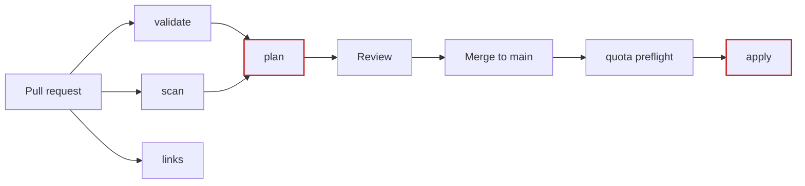

# CI standards

What runs on a pull request, what runs on merge, and the rules both pipelines
follow. Applies to GitHub Actions and Azure DevOps equally — that parity is the
point.

---

## 1. The checks

Every pull request runs seven checks. Six need no credentials and finish in
about a minute; only `plan` touches Azure.

| Check | Workflow | Typical | Blocks merge | What it catches |
|---|---|---:|---|---|
| `validate` | terraform | ~65s | yes | Formatting, `terraform validate` across 14 roots, tflint, cluster-policy contract, DAG import |
| `scan` | terraform | ~20s | yes | Trivy IaC — **CRITICAL blocks**, HIGH reported to code scanning |
| `plan` | terraform | ~45s | yes | Real `terraform plan` against Azure over OIDC |
| `links` | docs | ~6s | yes | 165+ internal doc links and ADR anchors resolve |
| `Trivy` | code scanning | ~4s | no | SARIF results surfaced as annotations |
| `GitGuardian` | app | ~2s | yes | Independent secret scan |
| `apply` | terraform | — | n/a | Skipped on PRs by design |



`plan` depends on `validate` and `scan` deliberately: there is no point spending
an Azure round trip on code that does not lint.

---

## 2. Rules both pipelines follow

**1. Pipelines contain no policy logic.** Both call `make` targets. A gate can
only diverge if someone edits a target list — not by one pipeline quietly
drifting from the other. The acceptance criterion is that a service can move
between CI platforms without its security posture changing
([ADR-013](DECISIONS.md#adr-013)).

**2. Everything CI runs, an engineer can run.** `make check` is the same set in
the same order. A check that only exists in the pipeline gets discovered at PR
time, which is the expensive place to discover it.

**3. No stored credentials.** OIDC federation on both platforms. The repository
variables are identifiers, not secrets; the two genuine secrets
(`OPERATOR_IP_CIDR`, `ALERT_EMAIL`) are secrets rather than variables purely so
they are masked in logs on a public repository.

**4. Green on first commit.** The Azure-dependent jobs are guarded on
`vars.AZURE_CLIENT_ID` and skip cleanly until bootstrap has been applied. A
pipeline that is red until someone wires up federation is a pipeline nobody
trusts afterwards.

**5. CRITICAL blocks, HIGH reports.** A gate that blocks on HIGH in a repository
this size blocks on things nobody intends to fix, and a gate people routinely
override is not a gate. Every suppression in `.trivyignore.yaml` states what it
covers, why it is acceptable, and **carries an expiry date**.

**6. The paths filter covers what the workflow executes.** Not just what it
deploys — `scripts/**`, `Makefile`, `.tflint.hcl` and `.trivyignore.yaml` too.

**7. Concurrency is one run per branch, never cancelled.** Two concurrent
applies against one state produce a lock timeout that looks like a hang.

---

## 3. Pipeline equivalence

| Concern | GitHub Actions | Azure DevOps |
|---|---|---|
| Trigger | `pull_request`, `push` to main, paths-filtered | `pr`, `trigger`, same paths |
| Auth | `azure/login@v2` + OIDC | `AzureCLI@2` + workload identity federation |
| Gate on config | `vars.AZURE_CLIENT_ID != ''` | `ne(variables['azureServiceConnection'], '')` |
| Approval | GitHub Environment | ADO Environment on a `deployment` job |
| Terraform install | `hashicorp/setup-terraform@v4` | Checksum-verified release asset, no marketplace extension |
| Gates | `make fmt-check lint validate scan policy-test dag-test` | identical |

The ADO pipeline installs Terraform from a checksum-verified download rather
than the marketplace `TerraformInstaller` task on purpose: that task needs an
organisation admin to install an extension, which makes the pipeline unrunnable
in a fresh organisation.

---

## 4. Action version policy

Pin to a **major** tag so security patches arrive without a pull request, except
where a project publishes no major tag.

| Action | Pin | Note |
|---|---|---|
| `actions/checkout` | `@v5` | Node 24; v4 emits a deprecation warning |
| `hashicorp/setup-terraform` | `@v4` | |
| `terraform-linters/setup-tflint` | `@v6` | |
| `github/codeql-action/upload-sarif` | `@v4` | Needs `security-events: write` |
| `actions/github-script` | `@v8` | |
| `azure/login` | `@v2` | |
| `aquasecurity/trivy-action` | `@v0.36.0` | **No major tag exists** — releases are `v0.x`, so pin the exact version |

**Verify a tag exists before pinning it.** `@0.28.0` without the `v` prefix does
not exist and failed the whole `scan` job with *"unable to find version"*:

```bash
gh api repos/<owner>/<repo>/git/matching-refs/tags \
  --jq '[.[].ref | sub("refs/tags/";"")] | map(select(test("^v[0-9]+$")))'
```

---

## 5. Secrets and variables

| Name | Type | Why |
|---|---|---|
| `AZURE_CLIENT_ID` | variable | Also the guard for the Azure jobs — `secrets` is unavailable in a job-level `if` |
| `AZURE_TENANT_ID` | variable | Identifier |
| `AZURE_SUBSCRIPTION_ID` | variable | Identifier |
| `TFSTATE_RESOURCE_GROUP` | variable | Identifier |
| `TFSTATE_STORAGE_ACCOUNT` | variable | Identifier |
| `UNIQUE_SUFFIX` | variable | Must match deployed names or Terraform plans a recreate |
| `PLATFORM_ADMIN_OBJECT_ID` | variable | Identifier |
| `OPERATOR_IP_CIDR` | **secret** | Personal address; masked in logs |
| `ALERT_EMAIL` | **secret** | Personal address; masked in logs |

**`ARM_*`, not `AZURE_*`.** `azure/login` exports `AZURE_CLIENT_ID` and
`AZURE_TENANT_ID`. The azurerm **backend** reads only `ARM_*`, and a backend
block cannot take Terraform variables — so those values must arrive through the
environment. Without them, `init` fails with *"a Tenant ID must be configured
when authenticating with OIDC"* immediately after a login that plainly
succeeded.

---

## 6. Configuration parity — the rule that matters most

**CI must plan the same platform the operator plans.**

`terraform.tfvars` is gitignored, correctly — it carries identifiers and the
operator's own address. That created a worse problem: CI passed three of ten
variables and planned against defaults for the rest.

Measured on a real pull request:

```
operator   No changes. Your infrastructure matches the configuration.
CI         Plan: 0 to add, 5 to change, 1 to destroy
```

Had it applied, CI would have removed the AKS API server allowlist and the
storage firewall rule, destroyed the action-group email receivers, and dropped
the AKS admin group binding. **A CI run silently degrading the platform's
security posture, every time.**

The rule that prevents it:

| File | Tracked | Holds |
|---|---|---|
| `environment.auto.tfvars` | **yes** | Configuration describing the *environment* — domains, budget, feature flags. Terraform loads `*.auto.tfvars` automatically, so neither CI nor a laptop can miss it |
| `terraform.tfvars` | no | Identifiers and the operator's own values. CI supplies the same values as `TF_VAR_*` |

**If a value belongs to the environment rather than to the person applying it,
it belongs in version control.**

---

## 7. What running it for real surfaced

Eight CI defects, none visible from reading the workflow.

| Symptom | Root cause |
|---|---|
| `scan` failed instantly | `trivy-action@0.28.0` does not exist — tags carry a `v` prefix |
| SARIF upload would have failed next | Missing `security-events: write` |
| `plan`/`apply` red on an unconfigured repo | No guard on `vars.AZURE_CLIENT_ID` |
| `AADSTS700213` on first OIDC exchange | GitHub issues an **immutable, ID-qualified** subject, not `repo:owner/repo` |
| `init` failed after a successful login | Backend needs `ARM_*`, login exports `AZURE_*` |
| Plan comment said "no summary line" | `make plan` colourises; an anchored grep never matched past the ANSI codes |
| First `apply` blocked on quota | Preflight compared the full ceiling against *available*, ignoring what the running cluster already held |
| Quota fix did not trigger CI | `scripts/**` absent from the paths filter |

Full root causes: [BUILD-LOG.md](BUILD-LOG.md). Diagnostics keyed by error
message: [TROUBLESHOOTING.md](TROUBLESHOOTING.md#7-ci).

---

## 8. Adding a check

1. Add a `make` target that runs it locally with no credentials.
2. Add it to `make check` so it runs in the local aggregate.
3. Call that target from **both** pipelines.
4. Add the paths it reads to **both** paths filters.
5. Decide whether it blocks or reports, and write the reason down.

A check added to only one pipeline is a check that will diverge. A check that
blocks without a stated reason is a check someone will disable.
