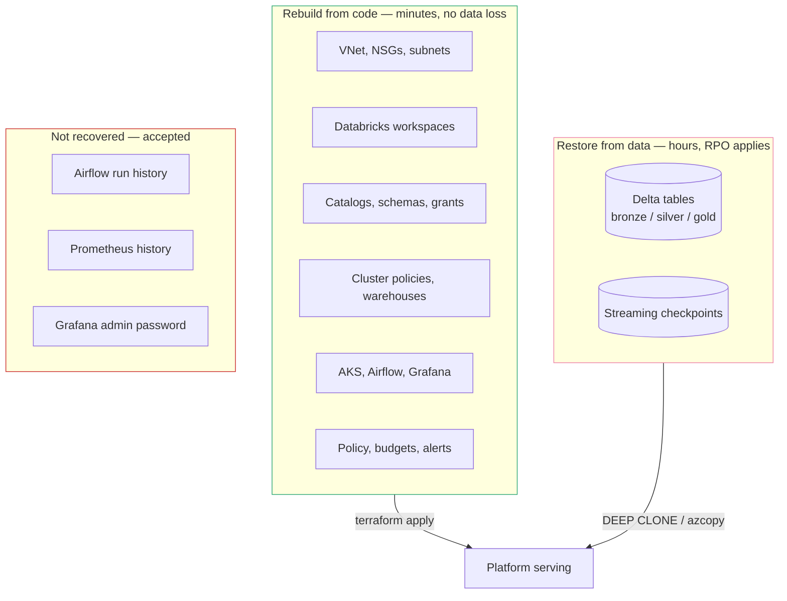
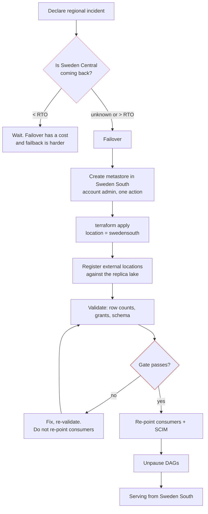

# Disaster recovery

Recovery objectives, failure modes and procedures, aligned with Databricks and
Microsoft regional-resiliency guidance.

**The premise.** A Databricks workspace and a Unity Catalog metastore are
regional and cannot be moved. So DR is not failover of a running system — it is
a rebuild of the control plane from Terraform plus a restore of data from
another region. That makes the recovery time dominated by data, not by
infrastructure, which is the opposite of most people's intuition.

---

## 1. Objectives

| Scenario | RTO | RPO | Mechanism |
|---|---|---|---|
| Pod or node loss | < 5 min | 0 | Kubernetes reschedules; AKS autoscaler replaces |
| AKS cluster loss | < 60 min | 0 for data | `make apply` + `make platform-deploy`. Airflow history lost |
| Accidental table delete/overwrite | < 30 min | 0 | Delta time travel — `RESTORE TABLE … VERSION AS OF` |
| Storage account deletion | < 4 h | up to 7 d | Soft delete (7 d) for blobs and containers |
| Availability-zone loss | < 15 min | 0 | **prod only** — ZRS storage. Sandbox is LRS and is not protected |
| Region loss (Sweden Central) | 4–8 h | 24 h | Rebuild in Sweden South + restore from `DEEP CLONE` |
| Metastore corruption | < 2 h | 0 | Rebuild catalogs from Terraform; data is in the lake |
| Ransomware / malicious delete | 4–24 h | up to 24 h | Immutable copy in the paired region — see §5 |

**Sandbox meets none of the regional numbers.** It runs LRS storage, a Free-tier
AKS control plane with no SLA, and no cross-region copy. Those are stated as
objectives for the production design, and the gap is the honest answer to "is
this DR'd" — see [ADR-002](DECISIONS.md#adr-002).

---

## 2. What actually needs recovering



The split is the point. **Everything in the left column is code**, so its
recovery time is an apply, not a restore — which is the strongest argument for
building the platform in Terraform rather than by hand.

**What is deliberately not recovered:** Airflow run history and task state
(in-cluster Postgres — [ADR-010](DECISIONS.md#adr-010)), Prometheus history
(7-day retention by design), and the Grafana admin password (regenerated). None
holds unique state: the DAGs are in git, and the data is in Delta.

---

## 3. Region loss — the procedure

Target: **RTO 4–8 hours, RPO 24 hours**, driven by the nightly `DEEP CLONE` to
the paired region.



**Step 1 is the manual one.** Creating a Unity Catalog metastore is an
account-level operation and cannot be done by the workspace-scoped provider
([ADR-007](DECISIONS.md#adr-007)). It is roughly two minutes in the account
console, and it is the reason a fully unattended regional failover is not
possible today.

**Do not skip the validation gate under pressure.** Re-pointing consumers at a
partially restored lake converts an availability incident into a data-correctness
incident, which is far more expensive and much harder to explain afterwards.

---

## 4. Why `DEEP CLONE` and not storage replication

| Option | Protects against | Fails against |
|---|---|---|
| GRS / RA-GRS | Region loss | **Corruption** — replicates the bad write as faithfully as the good one |
| Delta `DEEP CLONE` + time travel | Region loss **and** corruption | Costs egress and compute |
| Both | Everything | Pays twice |

The lake uses LRS in sandbox and ZRS in prod, with cross-region protection by
`DEEP CLONE` rather than by GRS. The reason is the failure mode that actually
happens: a bad transformation that overwrites silver is replicated to the
secondary within seconds by storage replication, and both copies are then wrong.
A nightly clone plus Delta's version history means the previous good version
still exists.

```sql
-- Nightly, into the paired region
CREATE OR REPLACE TABLE swedensouth.silver.shipments
DEEP CLONE swedencentral.silver.shipments;
```

`DEEP CLONE` is incremental and re-runnable — the second run copies only files
added since the first. That is what keeps a nightly job affordable and what
makes the final sync in a planned migration short
([MIGRATION-YODA.md](MIGRATION-YODA.md)).

---

## 5. Ransomware and malicious deletion

The scenario storage replication is worst at, and the one most likely to end a
career.

| Control | State | Protects |
|---|---|---|
| Blob soft delete, 7 days | applied | Accidental delete |
| Container soft delete, 7 days | applied | Accidental container delete |
| Delta time travel | applied | Bad overwrite, wrong merge |
| Blob versioning | prod | Overwrite of non-Delta files |
| **Immutable (WORM) copy in the paired region** | designed | Deliberate destruction by a compromised admin |
| Resource locks on the lake RG | designed | `terraform destroy` against the wrong environment |

**The gap that matters:** a compromised identity with `Storage Blob Data
Contributor` can delete data, and soft delete only buys seven days. The
production answer is an immutable-policy copy in Sweden South that the primary
platform's identities cannot write to — a separate trust boundary, not just a
separate region.

---

## 6. Testing

A DR plan that has never been executed is a hypothesis.

| Test | Cadence | Method |
|---|---|---|
| Rebuild from empty | Per change to the modules | `make destroy` then `make apply` — the sandbox is designed for this |
| Delta restore | Monthly | `RESTORE TABLE … VERSION AS OF` on a scratch table |
| Cluster rebuild | Monthly | `make destroy ENV=sandbox` scoped to AKS, then redeploy |
| Regional failover | Annually | Full rehearsal into Sweden South |
| Restore validation gate | Every test | Row counts, checksums, grants, schema |

The sandbox is genuinely rebuilt from nothing on a regular basis — that is the
strongest DR evidence in this repository, and it is why the environment being
disposable is a feature rather than a limitation.

---

## 7. Dependencies outside our control

| Dependency | Failure impact | Mitigation |
|---|---|---|
| Databricks control plane (regional) | No cluster launches, no UI | None available. Track the Databricks status page |
| Entra ID | No authentication anywhere — the whole platform | None. Tenant-level, Microsoft-operated |
| GitHub (git-sync, CI) | DAGs stop updating; running DAGs continue | Mirror to Azure Repos |
| Docker Hub / PyPI | Image builds fail | Cache base images in ACR |

**Entra ID is the true single point of failure.** Every identity in this
platform — human, workload and CI — authenticates through it. That is the
accepted cost of removing stored credentials
([ADR-005](DECISIONS.md#adr-005)): the trade is many small secrets for one large
dependency, and it is the right trade, but it should be made knowingly.
