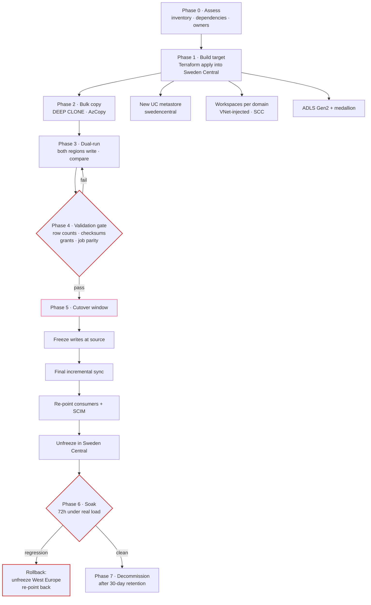
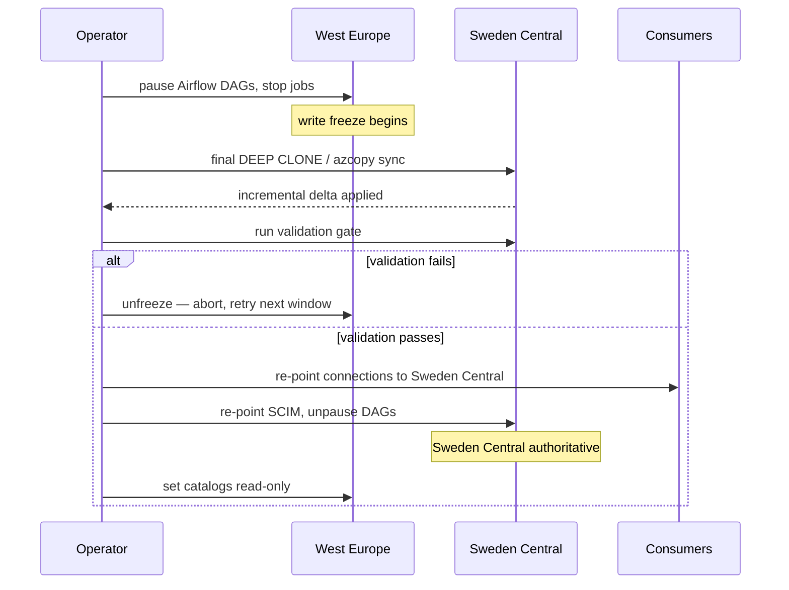

# YODA Central Data Platform: West Europe → Sweden Central

Migration strategy for the YODA Central Data Platform and its domain teams,
aligned with Databricks and Microsoft disaster-recovery guidance, designed for
minimal downtime.

**Governing constraint.** A Unity Catalog metastore is regional and cannot be
moved. Neither can a Databricks workspace. So this is not a lift — it is a
rebuild in the target region followed by a controlled data and workload
cutover. Everything below follows from that.

---

## 1. What actually has to move

| Asset | Movable in place? | Method | Downtime |
|---|---|---|---|
| Databricks workspace | **No** | Rebuild via Terraform | None (parallel) |
| Unity Catalog metastore | **No** | New metastore in Sweden Central | None (parallel) |
| Managed Delta tables | No | `DEEP CLONE` then incremental | Seconds at cutover |
| External Delta tables | No | AzCopy + re-register external location | Seconds at cutover |
| Notebooks, Repos | Yes | Git — already the source of truth | None |
| Jobs, workflows | No | Terraform / Databricks asset bundles | None (parallel) |
| Cluster policies | No | Terraform (`modules/databricks-compute`) | None (parallel) |
| Grants, groups | Partly | Terraform + SCIM re-point | None (parallel) |
| Secrets | No | Re-create in Key Vault; nothing is exported | None |
| Airflow DAGs | Yes | Git-synced | None |
| Airflow metadata | No | Rebuild; history is not migrated | Scheduler pause |

**What makes near-zero downtime possible:** the target is built and validated
while the source keeps serving. Only the final incremental sync and the
consumer re-point are in the outage window.

---

## 2. Migration flow



---

## 3. Phase detail

### Phase 0 — Assess (2 weeks, no change)

Produce an inventory nobody disputes. The migration fails at cutover if this is
incomplete, and the usual omission is a consumer nobody knew about.

- Every table, its size, its owner, its refresh cadence.
- Every job and its upstream and downstream dependencies.
- **Every consumer**: Power BI datasets, JDBC clients, Delta Sharing recipients,
  downstream domains. Query the Unity Catalog audit log for the trailing 90 days
  rather than asking around — the audit log knows about consumers that no
  architecture diagram does.
- Every external location and storage credential.
- Grants, group memberships and the SCIM configuration.

Output: a table-by-table migration register with an owner and a wave number.

### Phase 1 — Build the target (parallel, no downtime)

`terraform apply` against Sweden Central. This is the same module set already
in this repository, which is the point of it existing.

- New Unity Catalog metastore in Sweden Central ([ADR-007](DECISIONS.md#adr-007)
  applies: created once by an account admin).
- Workspace per domain, VNet-injected with Secure Cluster Connectivity.
- ADLS Gen2 with the medallion containers.
- Cluster policies, budgets, Azure Policy baseline, diagnostics.
- SCIM provisioning configured but **not yet cut over** from West Europe.

Validate with `make plan ENV=prod` returning no changes, then apply.

### Phase 2 — Bulk copy (parallel, no downtime)

Move by wave, largest tables first — they have the longest incremental tail.

**Managed tables — Delta `DEEP CLONE`:**

```sql
CREATE TABLE swedencentral_catalog.silver.shipments
DEEP CLONE westeurope_catalog.silver.shipments;
```

`DEEP CLONE` is incremental and re-runnable: running it again copies only files
added since the last run. That property is what makes the cutover window short —
the final sync in Phase 5 is the same statement against a table that is already
99 percent copied.

**External data — AzCopy:**

```bash
azcopy sync \
  "https://<source>.dfs.core.windows.net/silver" \
  "https://<target>.dfs.core.windows.net/silver" \
  --recursive --delete-destination=false
```

**Cost to plan for.** Cross-region egress from West Europe is charged per GB and
is usually the largest single line in the migration budget. Estimate it from the
inventory in Phase 0 before committing to a date.

### Phase 3 — Dual-run (2–4 weeks)

Both regions produce the same tables from the same sources. West Europe remains
authoritative; Sweden Central is shadow.

This phase exists to find the things validation cannot predict: a job that
depends on a workspace-local file, a hard-coded region in a notebook, a
permission that was granted in the portal years ago and never written down.

Run the migration DAGs in Sweden Central on the same schedule and diff the
output nightly.

### Phase 4 — Validation gate

Cutover is blocked until every check passes. No exceptions, because an
exception here becomes a data-correctness incident after cutover.

| Check | Method | Pass criterion |
|---|---|---|
| Row counts | `COUNT(*)` per table per partition | Exact match |
| Content | Checksum of a sampled column set | Exact match |
| Schema | `DESCRIBE` diff | Identical, including nullability |
| Grants | Compare `SHOW GRANTS` output | Identical principal → privilege set |
| Jobs | Run parity over the dual-run window | Same outputs, comparable durations |
| Consumers | Every consumer from Phase 0 tested against the target | All confirm |
| Freshness | Latest partition timestamp | Within one refresh interval |

### Phase 5 — Cutover (the only outage window)

Target: **under 30 minutes**, scheduled in the lowest-traffic window.



Order matters: West Europe becomes **read-only, not deleted**. That is what
makes the rollback in Phase 6 possible.

### Phase 6 — Soak (72 hours)

Sweden Central serves real load. West Europe stays read-only and warm.

Rollback trigger — any one of: a failed validation re-check, a consumer unable
to connect after remediation, data-correctness regression, or sustained
performance regression beyond the agreed threshold.

Rollback is: unfreeze West Europe, re-point consumers back, re-point SCIM.
Recovery time is bounded by the consumer re-point, roughly the same 30 minutes
as the cutover — provided nothing has written to Sweden Central that West Europe
lacks, which is why the soak window is short and heavily monitored.

### Phase 7 — Decommission

Only after 30 days of clean operation:

1. Export a final backup of the West Europe lake to cool storage.
2. Destroy West Europe workspaces and the storage account via Terraform.
3. **Remove `westeurope` from `allowed_locations`** in
   `modules/governance` — the step that makes the migration irreversible, and
   the one most likely to be forgotten. A "temporary" second region left in the
   policy is how it becomes permanent.
4. Archive the migration register.

---

## 4. Risk register

| Risk | Impact | Mitigation |
|---|---|---|
| Unknown consumer discovered post-cutover | Broken report, lost trust | Phase 0 audit-log analysis, not interviews; 30-day read-only source |
| Egress cost exceeds estimate | Budget overrun | Estimate from the Phase 0 inventory; migrate in waves; compact small files first |
| Grants do not transfer cleanly | Access denied or over-granted | Grants are Terraform-managed here; diff `SHOW GRANTS` in the gate |
| SCIM re-point drops group membership | Mass access loss | Re-point during the window with membership snapshot taken first |
| Cutover window overruns | Extended outage | `DEEP CLONE` incremental keeps the final sync small; rehearse in Phase 3 |
| Sweden Central lacks a needed feature | Blocked migration | Verified in Phase 0; see [ADR-001](DECISIONS.md#adr-001) |
| Airflow history lost | Lost audit trail | Accepted — [ADR-010](DECISIONS.md#adr-010); export runs to a gold table first if required |

---

## 5. Relationship to disaster recovery

This migration and the DR design share their mechanism — `DEEP CLONE` into
another region, Terraform to rebuild the control plane — but not their
objective. Migration is a one-way, planned move with a validation gate. DR is an
unplanned failover with an RPO. Building the migration well produces most of the
DR capability as a side effect, which is the argument for doing it with
Terraform rather than by hand.

See [DR.md](DR.md) for RTO/RPO targets and the failover procedure.
