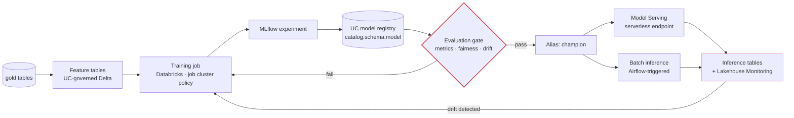

# MLOps

Model lifecycle infrastructure on this platform. **Designed, not implemented** —
stated up front so the rest reads as a plan rather than a description.

The JD lists MLOps under "support AI and machine learning platform
capabilities" and again as a nice-to-have. What follows is the build path that
fits the platform as it already exists, and what it would cost.

---

## 1. Position: models are data products

A model registered in Unity Catalog is governed by the same grants, audited by
the same log and attributed to the same cost centre as the tables it was trained
on. That is the whole argument for using the UC model registry rather than a
separate MLflow tracking server:

| Concern | Workspace MLflow registry | **Unity Catalog registry** |
|---|---|---|
| Access control | Workspace ACLs, separate from data | Same grants as the data |
| Lineage | Manual | Automatic, table → model |
| Cross-workspace sharing | Copy the artefact | Reference a three-level name |
| Audit | Workspace log | Same `unityCatalog` log already shipped to Log Analytics |
| Governance boundary | Its own | The domain's catalog |

A model whose training data a user cannot read should not be a model that user
can query. Collapsing both onto one authorisation point is what makes that
statement true rather than aspirational.

---

## 2. Target flow



The loop is the point. A model deployment pipeline without the return arrow from
monitoring to retraining is a deployment pipeline, not MLOps.

---

## 3. What it needs, in build order

| # | Component | Effort | Standing cost |
|---|---|---|---|
| 1 | UC schema per domain for models and features | trivial — `schemas` variable | 0 |
| 2 | ML runtime allowed in the cluster policy | small | 0 |
| 3 | MLflow experiment tracking | already present in the workspace | 0 |
| 4 | Training DAG + evaluation gate | moderate | job DBU only |
| 5 | Model Serving endpoint | moderate | **billed while provisioned** |
| 6 | Lakehouse Monitoring on inference tables | moderate | compute per refresh |
| 7 | Feature Engineering tables | moderate | storage |

**Steps 1–4 cost nothing at rest** and would be the sensible first increment.
Step 5 is where MLOps starts having a monthly bill: a serving endpoint bills for
provisioned concurrency whether or not anything calls it. On a EUR 50 budget
that is the single decision worth deferring — batch inference through the
existing Airflow DAG covers most logistics use cases (ETA prediction, volume
forecasting) without it.

---

## 4. Changes to what already exists

**Cluster policy** — the ML runtime is currently excluded by the version regex:

```json
"spark_version": {
  "type": "regex",
  "pattern": "^15\\.4\\.x-(cpu-ml-)?scala2\\.12$"
}
```

`policies/databricks/base-cluster-policy.json` is the single place to change it,
and `make policy-test` will confirm the control is still locked afterwards.

**Schemas** — one variable, in the `unity-catalog` module call:

```hcl
schemas = {
  bronze   = "Raw history, append-only."
  silver   = "Cleansed, conformed entities."
  gold     = "Business-level aggregates."
  features = "Feature tables. Point-in-time correct, UC-governed."
  models   = "Registered models. Same grants as the data they were trained on."
}
```

**Grants** — data scientists need `EXECUTE` on models and `SELECT` on features,
which is a new group (`yoda-ml-engineers`) rather than an extension of
`data-engineers`. Training and serving are different privileges from pipeline
authorship.

**Airflow** — `DatabricksSubmitRunOperator` already triggers the training job.
No new operator is needed; the DAG shape is identical to the medallion one, with
the evaluation gate in the same position as the data-quality gate.

---

## 5. The evaluation gate

Structurally the same decision as the data-quality gate between silver and gold,
for the same reason: **promote nothing that has not been checked, because
consumers read it immediately.**

| Check | Blocks promotion when |
|---|---|
| Primary metric vs champion | New model is not better on held-out data |
| Metric vs absolute floor | Better than champion but still below the business threshold |
| Fairness across segments | Aggregate improves while a segment regresses |
| Training/serving skew | Feature distributions differ from production |
| Inference latency | p95 exceeds the serving budget |

Promotion is an **alias move** (`champion`), never a redeploy. That makes
rollback a second alias move — seconds, not a pipeline run — which is the
property that matters at 02:00.

---

## 6. Monitoring

Lakehouse Monitoring on the inference table gives drift and quality metrics as
Delta tables, which means the existing stack covers them with no new tooling:
Grafana can query them, and the alert rules follow the same symptom-based
philosophy.

Alerts worth having, and the symptom each represents:

| Alert | Symptom |
|---|---|
| Prediction drift beyond threshold | The model is seeing a world it was not trained on |
| Feature drift on a top-importance feature | An upstream pipeline changed |
| Ground-truth accuracy decay | The model is now wrong, measurably |
| Serving p95 latency | Consumers are timing out |

Nothing alerts on GPU utilisation or endpoint CPU, for the same reason nothing
alerts on node memory — [ADR-009](DECISIONS.md#adr-009).

---

## 7. Honest assessment

This is a credible plan and it is not evidence. The platform demonstrates
Databricks administration, Unity Catalog governance, orchestration and
Kubernetes; it does not currently demonstrate a model in production.

The smallest increment that would change that is steps 1–4: a UC-registered
model, a training DAG with an evaluation gate, and batch inference written back
to gold. That costs job DBU only and would fit the existing quota and budget —
which makes it the obvious next piece of work rather than a rewrite.
