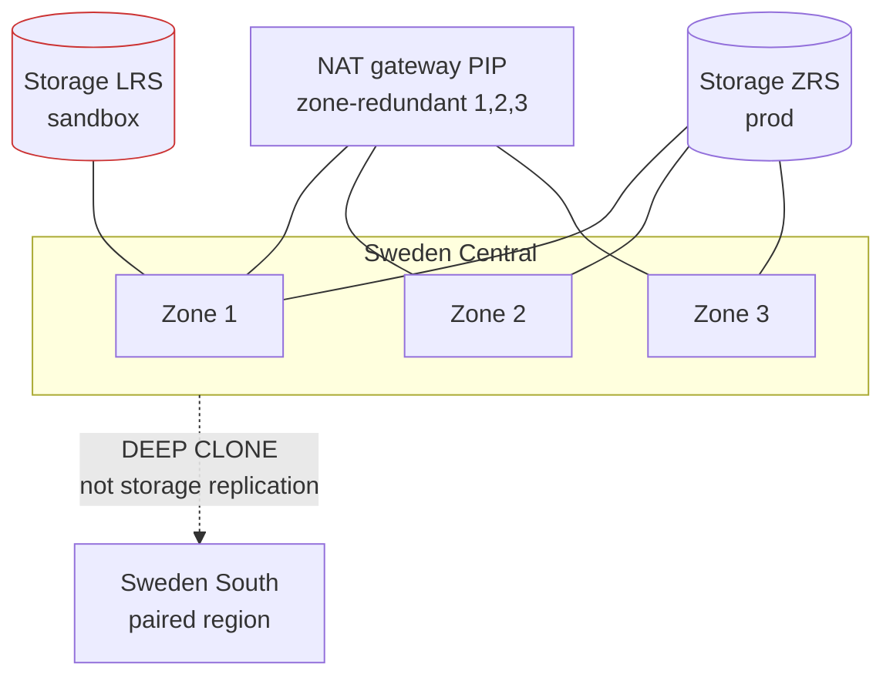

# Network architecture against the CIA triad

The network design, expressed as what each control defends. Confidentiality,
Integrity and Availability are used here as the organising frame because they
force the question every network diagram avoids: *what does this rule actually
stop, and what breaks when it fails?*

---

## 1. Address plan

```
vnet-yoda-<env>  10.60.0.0/16
  10.60.0.0/24    snet-platform          AKS nodes                trust: platform
  10.60.1.0/24    snet-privatelink       private endpoint NICs    trust: restricted
  10.60.2.0/26    AzureFirewallSubnet    prod only
  10.60.2.64/26   AzureBastionSubnet     prod only
  10.60.16.0/20   databricks block       /24 host + /24 container per workspace
     16.0/24 + 17.0/24   ws-central
     18.0/24 + 19.0/24   ws-logistics
     ... up to 8 workspaces
```

The plan is fixed, not computed from a pool. A data platform's CIDRs are
referenced from outside Terraform — partner allowlists, on-premises route
tables, firewall rules — and a CIDR that moves when a list reorders is a CIDR
that causes an incident.

**Trust levels, highest to lowest:**

| Segment | Runs what | May initiate to | May be reached by |
|---|---|---|---|
| `privatelink` | Nothing. PaaS NICs only. | Nothing | The VNet |
| `databricks` | Customer code over customer data | Databricks control plane, storage, Entra | Nothing inbound |
| `platform` | Orchestration and observability | Databricks REST, storage, Entra, git | Operator IP on 443 |

---

## 2. Confidentiality — stopping data reaching somewhere it should not

```mermaid
flowchart LR
    subgraph INET[Internet]
        ATK((Unauthorised<br/>caller))
        OP((Operator))
    end

    subgraph VNET[VNet 10.60.0.0/16]
        AKS[snet-platform<br/>AKS]
        DBX[snet-dbx-*<br/>injected]
    end

    LAKE[(ADLS Gen2<br/>default_action = Deny<br/>shared keys disabled)]

    ATK -x|"1 - storage firewall"| LAKE
    ATK -x|"2 - NSG DenyAllInbound"| DBX
    OP -->|"3 - allowlisted /32, 443"| AKS
    AKS -->|"4 - service endpoint"| LAKE
    DBX -->|"4 - service endpoint"| LAKE

    style ATK stroke:#c33
```

| # | Control | Defends against | Fails how |
|---|---|---|---|
| 1 | Storage firewall `default_action = Deny` | A valid Entra token used from an unapproved network | Loudly — 403 at the data plane |
| 2 | NSG `DenyAllInbound` on injected subnets | Anything dialling a cluster node | Loudly — connection refused |
| 3 | Operator IP allowlist on AKS API, Key Vault, storage | Credential theft used from elsewhere | Loudly — but a changed home IP locks the operator out too |
| 4 | Service endpoints (prod: private endpoints) | Traffic traversing the public internet | Silently — traffic still works, just less privately |

**The strongest confidentiality control here is not a network control.**
`shared_access_key_enabled = false` removes the storage key entirely, so the
credential that normally leaks does not exist. Network rules are the second
layer, not the first.

**Secure Cluster Connectivity** means no cluster node has a public IP and the
control plane never initiates inbound — the worker dials out and holds the
tunnel. That is why `DenyAllInbound` on the Databricks NSG is unconditional
rather than gated behind a variable: nothing legitimate ever arrives inbound.

**Known gap in sandbox.** Private endpoints and private DNS are off (~EUR 7 per
endpoint per month). Traffic reaches storage over service endpoints — on the
Azure backbone, not the internet, but the account still answers on its public
name to allowlisted sources. `prod` sets `public_network_access_enabled = false`
with endpoints and DNS zones, which is the materially stronger posture.

---

## 3. Integrity — stopping data being changed by the wrong thing

Network controls contribute less here than identity controls do, and saying so
is more useful than overstating them.

| Control | Layer | What it protects |
|---|---|---|
| `is_hns_enabled = true` | Storage | Delta's commit protocol needs atomic rename; without HNS, concurrent writers corrupt tables |
| Access Connector is the sole writer | Identity | No human or job can write to the lake directly |
| Unity Catalog `USER_ISOLATION` | Compute | Row filters and column masks actually apply; a lesser access mode reads the underlying files |
| NSG default-deny between segments | Network | The platform subnet cannot reach Databricks-injected subnets laterally |
| Azure Policy `Deny` on TLS < 1.2 and shared keys | Governance | Blocks the misconfiguration at creation rather than detecting it later |
| `quarantine` container | Pipeline | Failed rows are held, not dropped — a failure can be investigated |

**The quality gate sits between silver and gold**, not after gold. Integrity of
the *published* interface is what consumers depend on; checking after
publication means consumers have already read the bad data.

---

## 4. Availability — keeping it reachable, and being honest about what does not



| Control | Protects against | Sandbox | Prod |
|---|---|---|---|
| Zone-redundant NAT public IP | One zone failing takes all egress | n/a (no NAT) | Yes |
| Storage replication | Zone loss | LRS — **not protected** | ZRS |
| AKS autoscaler asymmetry | Cold starts on scale-down churn | Yes | Yes |
| AKS uptime SLA | Control-plane unavailability | Free tier — **no SLA** | Standard |
| Cross-region DR | Region loss | Documented, not built | `DEEP CLONE` to Sweden South |

**Two availability controls here can cause the outage they exist to prevent**,
and both are deliberate:

1. **Log Analytics `daily_quota_gb = 1`.** When hit, ingestion stops until
   00:00 UTC and the platform goes blind. Accepted because uncapped ingestion
   from a log-looping pod could exhaust the subscription credit and take down
   *everything*, not just telemetry. The `alert-ingest-near-cap` rule fires at
   80 percent so there is time to act.

2. **`max_surge = "10%"` on a one-node pool.** Rounds down to zero surge, so
   upgrades drain and replace in place with brief downtime — because one extra
   node would exceed the 4 vCPU quota and stall the upgrade indefinitely. A
   brief outage beats an upgrade that cannot run.

**Egress and the 2025 change.** Azure retired default outbound access for VNets
created after 30 September 2025. AKS is unaffected — its Standard Load Balancer
carries outbound rules. Classic Databricks compute is not, which is why the NAT
gateway exists in code and why enabling classic compute without it produces a
control-plane timeout rather than an obvious egress error
([ADR-004](DECISIONS.md#adr-004)).

---

## 5. Egress rules for the Databricks subnets

Service tags rather than address ranges, so the rules survive Azure re-IPing its
own services.

| Priority | Direction | Destination | Port | Why |
|---|---|---|---|---|
| 200 | Both | `VirtualNetwork` | any | Worker-to-worker; Spark shuffle needs it |
| 210 | Out | `AzureDatabricks` | 443 | Control plane and the SCC tunnel |
| 220 | Out | `Sql` | 3306 | Legacy Hive metastore |
| 230 | Out | `Storage` | 443 | The lake |
| 240 | Out | `EventHub` | 9093 | Log and metric delivery |
| 250 | Out | `AzureActiveDirectory` | 443 | Token acquisition |
| 4000 | In | any | any | **Deny** — unconditional under SCC |
| 4000 | Out | any | any | **Deny** — only when `enable_strict_egress` |

**Why the outbound deny is off by default.** A missing allow rule under a
deny-all does not fail at apply time. It fails when a cluster silently cannot
reach the control plane, which surfaces as an unexplained launch timeout — a far
worse thing to debug than an open egress rule. The intended sequence is: enable
flow logs, observe real egress for a fortnight, then enforce.

**Why rules are separate `azurerm_network_security_rule` resources** rather than
inline blocks: the Databricks resource provider adds its own worker-to-worker
rules to the NSG when a workspace is created. With inline blocks Terraform reads
those as drift and deletes them on the next apply, which breaks the workspace.

---

## 6. Kubernetes network policy

Cilium in eBPF — no sidecar, so no per-pod CPU and memory cost. Default-deny
both directions in the `airflow` namespace, with four explicit exceptions:

| Policy | Allows | Without it |
|---|---|---|
| `allow-dns` | UDP/TCP 53 to kube-dns | Nothing resolves; every hostname-based rule silently fails |
| `allow-airflow-internal` | Pod-to-pod within the namespace | Scheduler cannot reach Postgres |
| `allow-https-egress` | 443 to `0.0.0.0/0` **except RFC1918** | Cannot reach Databricks, Entra, ADLS or git |
| `allow-prometheus-scrape` | Ingress from `monitoring` on 9102, 8080 | Every Airflow metric target appears down |

The RFC1918 exclusions in `allow-https-egress` are the part that matters most.
Without them the rule would also permit traffic to every other pod and node in
the cluster, quietly undoing the default-deny it sits behind.

Pod Security Admission runs `restricted` in enforce mode on `airflow`, blocking
privileged pods, host networking and host paths at admission — before the pod
exists, rather than after a NetworkPolicy has to contain it. `monitoring` runs
`privileged` because node-exporter genuinely needs host access, and scoping that
exception to one namespace is the reason the level is set per namespace.

---

## 7. What a reviewer should push back on

Stated plainly, because a design document that lists only strengths is not a
design document:

1. **Sandbox has no private endpoints.** Service endpoints keep traffic on the
   Azure backbone but the storage account still has a public endpoint. Cost, not
   architecture — one variable away.
2. **The operator IP allowlist is a single `/32`.** It breaks when the operator's
   address changes, and it is the reason the platform is reachable from a laptop
   at all. Bastion plus private endpoints is the production answer.
3. **No Azure Firewall in sandbox.** No L7 inspection or FQDN filtering on
   egress. `AzureFirewallSubnet` is reserved in the address plan for prod.
4. **Serverless Databricks bypasses this network entirely.** Every NSG rule here
   applies to classic compute, which sandbox does not run. Serverless egress is
   governed by Databricks, and reaching a private-only storage account from it
   needs a Network Connectivity Configuration — a different mechanism
   ([ADR-003](DECISIONS.md#adr-003)).
5. **LRS storage in sandbox has no zone redundancy.** A zone failure loses the
   lake. Acceptable only because the environment is disposable.
