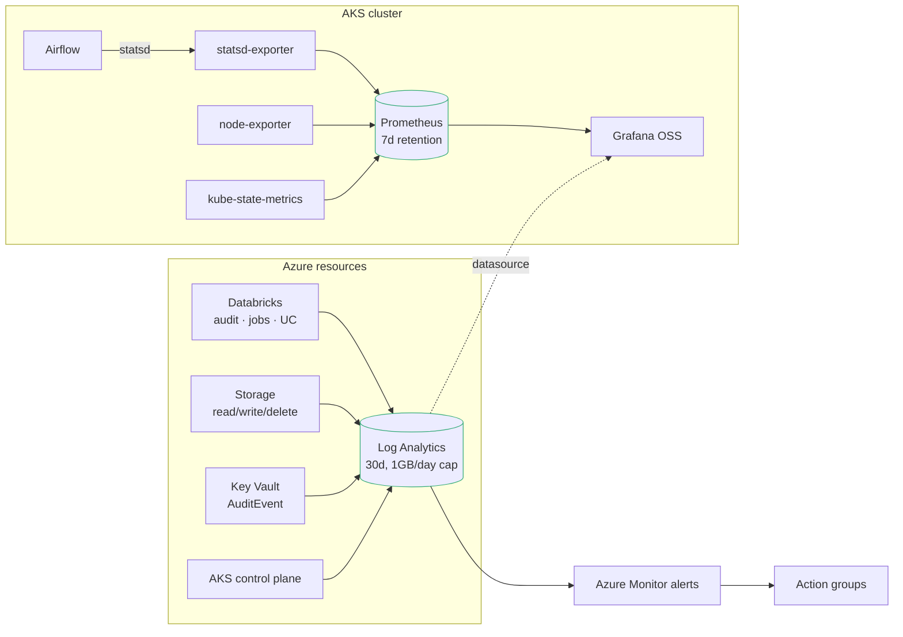

# Observability

What is collected, where it lives, what is alerted on, and why the split is
where it is.

---

## 1. Two stores, split by signal origin



| Store | Holds | Why it cannot be the other one |
|---|---|---|
| **Prometheus + Grafana** (in-cluster) | What workloads emit — DAG duration, task counts, pod and node metrics | Free, and the signals are already in the cluster |
| **Log Analytics** | What Azure emits *about* resources — Databricks audit, storage data-plane access, control-plane logs | Prometheus cannot see any of it. These are the only source |

This is a split by signal origin, not by preference. Azure resource logs simply
do not exist in Prometheus, and pod metrics do not belong in a per-GB log store.

Azure Managed Grafana was replaced by Grafana OSS to save ~EUR 45/month against
a EUR 50 budget — [ADR-011](DECISIONS.md#adr-011).

---

## 2. Service level objectives

SLOs are written from the consumer's perspective. "The cluster is healthy" is
not an SLO; "gold is fresh enough to report on" is.

| SLO | Target | Measured by | Breach means |
|---|---:|---|---|
| Gold freshness | Updated within 4h of the scheduled window, 99% of days | `record_freshness` marker absent | A report is wrong right now |
| Pipeline success | 99% of DAG runs succeed within 2 retries | Airflow task state via statsd | Tables not produced |
| Query availability | SQL warehouse answers within 60s of first query, 99% | Warehouse start latency | Analysts blocked |
| Platform availability | Airflow scheduler heartbeat < 60s stale, 99.5% | `airflow_scheduler_heartbeat` | Nothing is being scheduled |
| Lake durability | No unrecoverable data loss | Delta history + soft delete | Career event |

**Error budget.** 99% of days on freshness is roughly three bad days a quarter.
When the budget is spent, feature work on the platform stops and reliability
work starts. That rule only means something if it is agreed before it is needed.

---

## 3. Alerting philosophy

**Alerts fire on symptoms a user would notice. Nothing pages on CPU.**

"Node memory above 80 percent" pages someone for a condition the autoscaler is
already handling. "Gold tables are stale" means a report is wrong *now*. The
second is worth waking someone for; the first trains people to ignore the
channel, which is how the genuine page gets missed —
[ADR-009](DECISIONS.md#adr-009).

Every rule answers three questions, and one that cannot is not added:

1. What is broken for a user right now?
2. What should the person woken up actually do?
3. Why is this threshold and not a rounder number?

| Alert | Sev | Fires when | Runbook |
|---|---:|---|---|
| `alert-dbx-job-failure` | 1 | Any Databricks job run fails, 15m window | [job-failure](RUNBOOKS.md#job-failure) |
| `alert-uc-access-denied` | 2 | >10 UC denials from one principal in 1h | [access-denied](RUNBOOKS.md#access-denied) |
| `alert-lake-auth-failure` | 2 | >25 storage auth failures in 1h | [lake-auth-failure](RUNBOOKS.md#lake-auth-failure) |
| `alert-ingest-near-cap` | 2 | Log ingestion >80% of the daily cap | [ingestion-cap](RUNBOOKS.md#ingestion-cap) |

Severity 1 pages. Severity 2 and 3 raise a ticket and wait for office hours.
All four auto-resolve — an alert nobody closes is what makes the next one easy
to dismiss.

**Meta-monitoring.** `alert-ingest-near-cap` watches the control that can blind
the platform. The 1 GB/day cap stops ingestion until 00:00 UTC when hit, so the
alert fires at 80 percent while there is still time to find the noisy source
rather than reflexively raise the cap.

---

## 4. Dashboards

Dashboards live as ConfigMaps loaded by the Grafana sidecar. A dashboard edited
in the UI is lost on pod restart — deliberately, since the repository is the
source.

| Dashboard | Answers | Key panels |
|---|---|---|
| Platform health | Is anything broken? | Scheduler heartbeat, task success rate, node pressure, PVC usage |
| Data freshness | Is gold current? | Time since last successful run per domain, against the SLO line |
| Pipeline performance | Is anything getting slower? | DAG duration p50/p95 trend, task queue depth |
| Cost | Where is the money going? | DBU by domain, storage growth by layer, ingestion volume |
| Security | Anything unusual? | UC denials by principal, storage auth failures, Key Vault reads |

**Panels deliberately absent:** raw CPU and memory gauges. They are diagnostic
detail, not a health signal, and putting them on the first dashboard someone
opens teaches them to look at the wrong thing.

---

## 5. Cost control on telemetry

Observability that costs more than it prevents is a bad trade. Three controls:

| Control | Setting | Saves |
|---|---|---|
| Daily ingestion cap | 1 GB/day, hard | Bounds the worst case absolutely |
| Category selection | Databricks: 5 of ~20; AKS: `kube-audit-admin` not `kube-audit` | Roughly 90% of the volume |
| Retention | 30 days Log Analytics, 7 days Prometheus | Long-horizon trends belong in a gold table at a twentieth of the price |

**Databricks categories are enumerated, not `allLogs`.** Most of the twenty are
high-volume operational noise; `all` would exhaust a 1 GB cap before lunch and
blind the platform. The five kept — `accounts`, `unityCatalog`, `clusters`,
`jobs`, `secrets` — are the ones an audit or an incident actually reads.

Compliance retention is a different problem, solved by archiving to the lake
rather than by paying Log Analytics rates for two years of data nobody queries.

---

## 6. Accessing it

```bash
kubectl port-forward -n monitoring svc/kps-grafana 3000:80
kubectl get secret grafana-admin -n monitoring -o jsonpath='{.data.admin-password}' | base64 -d

kubectl port-forward -n airflow svc/airflow-webserver 8080:8080
```

Both are `ClusterIP`. A `LoadBalancer` would put the Airflow UI on the internet
behind nothing but a password. Production fronts both with an ingress
controller behind Entra authentication — a design the NetworkPolicy already
anticipates.

---

## 7. Gaps

| Gap | Impact | To close |
|---|---|---|
| No distributed tracing | Cannot follow one record end to end | OpenTelemetry collector, trace context through DAG and Spark |
| No log aggregation in-cluster | Pod logs are `kubectl logs` only | Loki, or Container Insights at per-GB cost |
| No synthetic checks | Freshness is inferred from job success, not from querying gold | A canary DAG that reads gold and asserts row counts |
| Grafana has no SSO | Shared admin password | Managed Grafana, or Grafana OSS with Entra OAuth |
| Alerts are email-only | No escalation if unread | PagerDuty or Opsgenie receiver on the action group |
| Prometheus is single-replica, 7d | History lost on node loss | Remote write to Azure Monitor Workspace |
