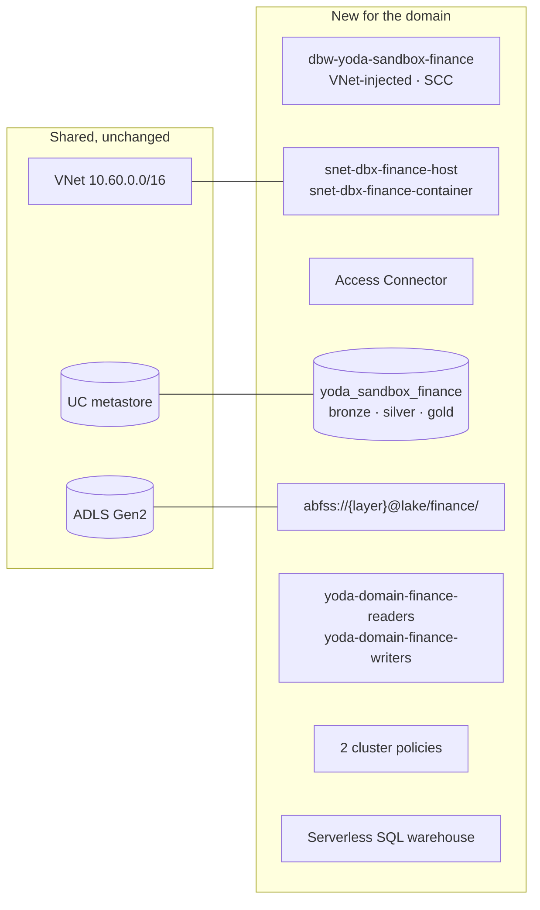

# Onboarding a data domain

Self-service is the goal; this is the path until it exists. Four changes, two
applies, roughly thirty minutes of wall-clock time — most of it waiting for a
Databricks workspace to provision.

The worked example adds a `finance` domain.

---

## What a domain gets



Its own workspace, catalog, subnets, groups, policies and cost attribution. A
workspace — not a catalog — is the boundary for cluster policies, workspace
admins and the DBU line on the bill, which is why domains do not share one
([ADR-006](DECISIONS.md#adr-006)).

---

## Step 1 — Declare the domain

`terraform/envs/sandbox/terraform.tfvars`:

```hcl
domains = ["logistics", "finance"]   # append only
```

> **Append only.** The network module allocates Databricks subnets by list
> index, so inserting or reordering renumbers every existing workspace — which
> Terraform will happily plan as a destroy-and-recreate of production
> workspaces. Add to the end.

This alone creates: the host/container subnet pair, the workspace, the Access
Connector, diagnostics, and the two Entra groups.

```bash
make plan  ENV=sandbox    # read it: expect ~8 additions, 0 destroys
make apply ENV=sandbox
```

**Check the plan for destroys.** Zero is the only acceptable number here.

---

## Step 2 — Add the Unity Catalog wiring

Terraform cannot select a provider from a `for_each` key, so each domain needs
an explicit provider alias and two module blocks. That ceremony is the cost of
the provider model, not a design choice ([ADR-008](DECISIONS.md#adr-008)).

`terraform/envs/sandbox-databricks/versions.tf`:

```hcl
provider "databricks" {
  alias = "finance"
  host  = data.terraform_remote_state.sandbox.outputs.databricks_workspaces["finance"].url
}
```

`terraform/envs/sandbox-databricks/main.tf` — extend the domain list, then add
the modules:

```hcl
locals {
  domain_layers = {
    for domain in ["platform", "logistics", "finance"] : domain => {
      for layer in local.layers : layer => "${local.lake_urls[layer]}${domain}/"
    }
  }
}

module "uc_finance" {
  source    = "../../modules/unity-catalog"
  providers = { databricks = databricks.finance }

  domain      = "finance"
  name_prefix = "yoda"
  environment = "sandbox"

  access_connector_id           = local.sandbox.databricks_workspaces["finance"].access_connector_id
  access_connector_principal_id = local.sandbox.databricks_workspaces["finance"].access_connector_principal_id
  storage_account_id            = local.sandbox.storage_account_id

  external_locations    = local.domain_layers["finance"]
  catalog_storage_layer = "silver"

  owner_principal  = local.owner
  writer_principal = local.group_names["domain-finance-writers"]
  reader_principal = local.group_names["domain-finance-readers"]
  enable_grants    = var.enable_grants

  isolation_mode = "ISOLATED"
}

module "compute_finance" {
  source    = "../../modules/databricks-compute"
  providers = { databricks = databricks.finance }

  name_prefix = "yoda"
  environment = "sandbox"
  domain      = "finance"
  cost_center = "finance"          # the domain's own cost centre, not the platform's
}
```

> **The path prefix is not optional.** Each domain owns
> `abfss://{layer}@lake/{domain}/`, never the container root. Unity Catalog
> external locations are metastore-scoped and may not overlap — registering the
> container root for a second domain fails, and had it succeeded both domains
> would hold the whole layer.

```bash
make plan  ENV=sandbox-databricks
make apply ENV=sandbox-databricks
```

---

## Step 3 — Populate the groups

Terraform creates the groups and owns what they can reach. It does **not** own
who is in them — membership changes far more often than this repository does,
and is handled by the joiner/mover/leaver process or by SCIM.

```bash
az ad group member add --group yoda-domain-finance-writers --member-id <object-id>
```

If Unity Catalog grants are enabled, the groups must already be synchronised
into the Databricks account by SCIM — see
[RUNBOOKS.md](RUNBOOKS.md#scim-provisioning).

---

## Step 4 — Add the pipeline

Copy `dags/logistics_medallion.py`, change `DOMAIN`, `CATALOG` and the job
policy ID. The DAG structure does not change between domains — that is the
point of the medallion contract.

```python
DOMAIN  = "finance"
CATALOG = os.environ.get("YODA_CATALOG_FINANCE", "yoda_sandbox_finance")
```

```bash
make dag-test    # import check, duplicate dag_id, catchup guard
```

DAGs are baked into the Airflow image, so the change reaches the scheduler
through a build and a rollout:

```bash
make platform-deploy ENV=sandbox
```

---

## Checklist

- [ ] `domains` appended, not reordered
- [ ] `make plan ENV=sandbox` shows **zero destroys**
- [ ] Provider alias added
- [ ] `uc_*` and `compute_*` modules added
- [ ] Domain added to `local.domain_layers`
- [ ] External locations use the `{domain}/` prefix
- [ ] `cost_center` set to the domain's own, not `data-platform`
- [ ] Groups populated
- [ ] DAG added, `make dag-test` passes
- [ ] `make cost ENV=sandbox` shows the new domain as a distinct row

That last item is the real acceptance test. A domain whose spend does not appear
separately is a domain that was not really onboarded.

---

## Limits

| Limit | Value | What happens beyond it |
|---|---:|---|
| Domains per VNet | **8** | The `/20` Databricks block is exhausted; widen it or move to a VNet per domain |
| Metastores per region | **1** | Shared by every workspace in Sweden Central |
| Catalogs per domain | 1 by convention | A second catalog creates a boundary nothing enforces |

Past roughly eight domains, the per-domain boilerplate and the address plan both
want rethinking — probably toward a workspace per business unit rather than per
domain. That is the revisit trigger recorded in
[ADR-006](DECISIONS.md#adr-006).

---

## Toward real self-service

The manual steps above are a queue with a platform engineer at the front of it —
exactly what a platform team should be automating away. The path:

1. **A domain manifest.** One YAML file per domain in the repository; a
   generator emits the Terraform. Removes steps 1 and 2.
2. **Terraform stacks or CDKTF.** Dynamic provider configuration would remove
   the explicit alias entirely, which is the only genuinely awkward part.
3. **A pull-request template plus CI.** A domain team opens a PR against the
   manifest; CI plans it and a platform engineer reviews rather than types.

None is built here. Step 1 is a weekend of work and would remove most of this
document, which is the strongest argument for doing it.
