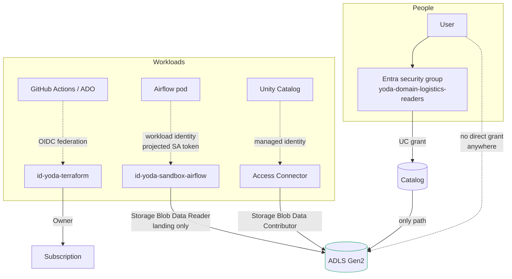

# Security

Identity, encryption, guardrails and audit — what is implemented, what is
designed, and what is deliberately not done.

The organising principle: **remove credentials rather than protect them.** The
most common way a data platform is compromised is a long-lived secret in a CI
variable group or a notebook. This platform has none to find.

---

## 1. Identity and access

**Three rules the design rests on.**

1. **Nothing is granted to a user.** Every Unity Catalog grant and every Azure
   role assignment targets a group. A joiner/mover/leaver process that has to
   hunt for direct grants misses some, and the misses are invisible until an
   audit finds them.
2. **Nothing holds a secret.** No client secret, storage key, SAS token or
   Databricks PAT exists. CI federates via OIDC; pods federate via AKS workload
   identity; Unity Catalog uses a managed identity.
3. **Unity Catalog is the only authorisation point for data.** No human holds
   storage RBAC — [ADR-012](DECISIONS.md#adr-012).

### Groups

| Group | Grants |
|---|---|
| `yoda-platform-admins` | Catalog ownership, break-glass lake access, AKS cluster-admin |
| `yoda-data-engineers` | Write across the platform catalog: bronze, silver, gold |
| `yoda-data-analysts` | Read `gold` only |
| `yoda-domain-logistics-writers` | Write across the logistics catalog |
| `yoda-domain-logistics-readers` | Read `gold` in the logistics catalog only |

Readers are excluded from bronze and silver **and** from `READ_FILES` on any
external location. A reader with file access could read the underlying Parquet
directly and bypass the column masks and row filters that make gold safe to
publish.

### Workload identities

| Identity | Federated subject | Holds |
|---|---|---|
| `id-yoda-terraform` | `repo:…:environment:sandbox` | Owner on the subscription |
| `id-yoda-sandbox-airflow` | `system:serviceaccount:airflow:airflow` | Reader on the lake, Key Vault Secrets User |
| Access Connector × 2 | Azure-managed | Storage Blob Data Contributor |
| `id-yoda-sandbox-kubelet` | Azure-managed | AcrPull |

The federation subject is namespace- and ServiceAccount-scoped, so compromising
the Grafana pod does not yield Airflow's access to Databricks.

Airflow deliberately has **read-only** access to the lake. It orchestrates; it
does not process data. Bronze, silver and gold are written by Databricks jobs
under their own identity.

---

## 2. Encryption

| Layer | At rest | In transit |
|---|---|---|
| ADLS Gen2 | Microsoft-managed + **infrastructure encryption** (second pass) | TLS 1.2 minimum, HTTPS only |
| Databricks DBFS root | Platform-managed | TLS |
| Cluster local disk | **Enabled** in the cluster policy | — |
| AKS OS and PVC disks | Azure Storage Service Encryption | — |
| Key Vault | HSM-backed | TLS 1.2 |
| Log Analytics | Microsoft-managed | TLS |

**Local disk encryption on clusters** is easy to overlook and matters: Spark
spills shuffle data to local disk, and that spill contains real customer
records. It is a `fixed` control in
`policies/databricks/base-cluster-policy.json`, asserted by
`make policy-test` in CI.

**Infrastructure encryption** must be set at storage account creation and
cannot be enabled later without recreating the account — which is why it is on
even in sandbox, where it buys little.

**Customer-managed keys** are in the prod path only. On a Free Trial
subscription a Premium Key Vault plus key rotation is not fundable, and CMK
without rotation is theatre.

---

## 3. Guardrails: Azure Policy

Assigned at subscription scope, **enforcing**, as the `yoda-sandbox-baseline`
initiative:

| Policy | Effect | Blocks |
|---|---|---|
| Allowed locations | Deny | Resources outside Sweden Central / West Europe. Residency, not cost |
| Storage secure transfer | Deny | TLS below 1.2, or shared key auth enabled |
| Deny public blob | Deny | Anonymous container access — the setting behind most public lake exposures |
| Databricks secure | Deny | A workspace without Secure Cluster Connectivity, or not Premium |
| Require tags | **Audit** | Missing `platform`, `environment`, `owner`, `cost-center` |

**Why tags are Audit and the rest are Deny.** A tag policy set to Deny on day
one blocks the very deployment that would have created the tagged resources, and
the resulting scramble teaches people to request exemptions rather than to tag.
Audit first, clear the compliance report, then flip. The security policies have
no legitimate exception on this platform and are Deny from the start.

The Databricks policy is Deny specifically because SCC and Premium **cannot be
turned on after creation** — a workspace created without them has to be rebuilt,
which means re-registering every external location and re-pointing every job.

---

## 4. Network

Summarised here; the full treatment with failure modes is in
[NETWORK-CIA.md](NETWORK-CIA.md).

| Control | State |
|---|---|
| Storage firewall default-deny | applied |
| Databricks Secure Cluster Connectivity, no public IPs | applied |
| VNet-injected workspaces, delegated subnets | applied |
| NSG default-deny inbound on all segments | applied |
| Cilium NetworkPolicy default-deny in `airflow` | applied |
| Pod Security `restricted` enforced | applied |
| AKS API server IP allowlist | applied |
| Private endpoints + private DNS | prod only (~EUR 7 each) |
| Azure Firewall, Bastion | prod only |
| Strict deny-all egress on Databricks subnets | designed, off — see below |

**Egress deny is off deliberately.** A missing allow rule under a deny-all does
not fail at apply time; it fails when a cluster silently cannot reach the
control plane. The intended sequence is: enable flow logs, observe real egress
for a fortnight, then enforce.

---

## 5. Audit

| Source | Destination | Why it is the only source |
|---|---|---|
| Databricks `unityCatalog` | Log Analytics | The record of who read which table |
| Databricks `accounts`, `clusters`, `jobs`, `secrets` | Log Analytics | Workspace administration |
| Storage read/write/delete | Log Analytics | Data-plane access to the lake |
| Key Vault `AuditEvent` | Log Analytics | Was this secret read before it was rotated? |
| AKS `kube-audit-admin` | Log Analytics | Cluster mutations, without the get/list flood |

Databricks categories are **enumerated, not `allLogs`**. Databricks exposes
around twenty categories, most of them high-volume operational noise; on a
1 GB/day cap, `all` would exhaust the quota before lunch and blind the platform.
`kube-audit-admin` rather than `kube-audit` for the same reason.

---

## 6. Supply chain

| Control | State |
|---|---|
| Airflow image built from a pinned base with constraints | applied |
| Image pushed to ACR, pulled with the kubelet identity | applied |
| ACR admin user disabled | applied |
| Trivy IaC scan, CRITICAL blocks the build | applied in CI |
| Trivy image scan | designed |
| Image pinned by digest in Helm values | applied |
| ACR content trust / signing | Premium only, not funded |

The Dockerfile installs against Airflow's published constraints file. Without
it, pip can resolve a provider's transitive dependency to a version Airflow's
own pin conflicts with, and the failure surfaces at DAG import rather than at
build.

---

## 7. Designed, not implemented

Stated explicitly, because a security document that lists only what is done is
misleading.

| Control | Why not | To close |
|---|---|---|
| **PIM for break-glass access** | Requires Entra ID P2, not on this tenant | Time-bound eligible assignment on `yoda-platform-admins` |
| **Conditional Access** | Requires P1/P2 | Require compliant device + MFA for platform admins |
| **Access reviews** | Requires P2 | Quarterly review of the five groups |
| **Defender for Storage / Containers** | ~EUR 15/month; CSPM free tier is on | `prod` tfvars |
| **Microsoft Purview** | Provider not registered; standing cost | Container `classification` metadata already set to drive scan scope |
| **Customer-managed keys** | Premium Key Vault, no rotation story | `prod` tfvars |
| **Unity Catalog grants applied** | SCIM not configured — [RUNBOOKS.md](RUNBOOKS.md#scim-provisioning) | Configure SCIM, `enable_grants = true` |

---

## 8. What a security reviewer should attack

1. **`id-yoda-terraform` holds Owner on the subscription.** Justified because it
   creates role assignments, which Contributor cannot. The narrower answer is
   Contributor + RBAC Administrator, and a shared subscription should use it.
2. **The operator IP allowlist is a single `/32`.** It is why the platform is
   reachable from a laptop at all. Bastion plus private endpoints is the
   production answer.
3. **Sandbox storage answers on its public endpoint**, protected by a firewall
   rather than being unreachable. `prod` sets
   `public_network_access_enabled = false`.
4. **Grafana has a local admin password**, not SSO — [ADR-011](DECISIONS.md#adr-011).
5. **Serverless Databricks compute bypasses every NSG here.** Egress is governed
   by Databricks, not by this VNet — [ADR-003](DECISIONS.md#adr-003).
6. **Airflow's git-sync pulls from a public GitHub repository over HTTPS.** No
   commit signature verification. A compromised repository is a compromised
   scheduler.
