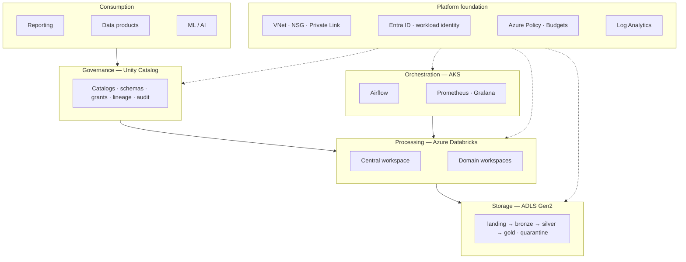

# Solution Design Document

**YODA Data Platform — Azure & Databricks**

| | |
|---|---|
| Document | Solution Design (SDD) |
| Version | 1.0 |
| Status | Issued for review |
| Date | 2026-08-05 |
| Author | Platform Engineering — Data Platform Team |
| Classification | Internal |
| Supersedes | — |

**Related documents:** [ARCHITECTURE.md](ARCHITECTURE.md) (technical design) ·
[DECISIONS.md](DECISIONS.md) (ADRs) ·
[MIGRATION-YODA.md](MIGRATION-YODA.md) (regional migration) ·
[COVERAGE.md](COVERAGE.md) (requirement traceability)

---

## 1. Executive summary

This document describes the design of the YODA Data Platform: an Azure- and
Databricks-based platform supporting analytics, AI, reporting and data-product
development for a logistics business, delivered entirely as infrastructure-as-code
and operated through CI/CD.

**What it delivers.** A governed lakehouse in which every data access is
authorised at a single point and recorded, domain teams own their own compute
and cost, and the entire platform can be rebuilt from source in under an hour.

**Three decisions define it.**

1. **Unity Catalog is the sole authorisation point for data.** No person and no
   job holds a storage role. This is what makes "who read this table" a question
   with an answer.
2. **A Databricks workspace per data domain.** The workspace — not the catalog —
   is the boundary for cluster policy, administration and the DBU line on the
   bill. Domains sharing one share all three.
3. **No stored credentials anywhere.** OIDC federation for CI, workload identity
   for workloads, managed identity for Unity Catalog. The credential that
   normally leaks does not exist.

**Delivery status.** The `sandbox` environment is deployed and operating against
a live subscription. The `prod` design is code-complete, validated and
deliberately unapplied — the reasons and the gap list are in §9.

**Investment position.** Running cost of the deployed environment is roughly
EUR 44/month. Design decisions avoided roughly EUR 238/month of standing cost
that a conventional build would have incurred; teardown of a superseded
environment removed a further EUR 90/month of unowned spend.

---

## 2. Business context and drivers

| Driver | Implication for the platform |
|---|---|
| Analytics, AI, reporting and data products served from one platform | A lakehouse, not a warehouse; governed sharing rather than extracts |
| Multiple domain teams, one central platform team | Self-service within guardrails; per-domain isolation and cost attribution |
| Swedish logistics operator | Data residency in Sweden; paired-region DR inside Sweden |
| Regulatory and audit obligations | Every data access recorded; retention explicit and enforced |
| Finite, monitored cloud budget | Cost attribution to domain; controls that prevent rather than report |

**The regional driver is material.** The existing YODA platform runs in West
Europe. Sweden Central places data in-country and pairs with Sweden South, so
the disaster-recovery story also stays inside Sweden. The migration is designed
in [MIGRATION-YODA.md](MIGRATION-YODA.md) and is a named deliverable, not a
consequence.

---

## 3. Scope

**In scope.** Platform infrastructure and its automation: networking, identity,
data lake, Databricks administration and Unity Catalog governance, Kubernetes,
workflow orchestration, observability, policy guardrails, FinOps tooling, CI/CD,
disaster-recovery design, and the West Europe → Sweden Central migration
strategy.

**Out of scope.** Business data models and transformation logic (domain teams
own these); BI tool configuration; source-system integration beyond the landing
contract; production ML models. MLOps *infrastructure* is designed
([MLOPS.md](MLOPS.md)) but not implemented.

**Assumptions.**

| # | Assumption | If false |
|---|---|---|
| A1 | One Unity Catalog metastore per region, shared by all workspaces | Multi-metastore changes the isolation model |
| A2 | Entra ID is the single identity provider | The no-stored-credentials position weakens |
| A3 | Domain teams can author Spark and SQL | Platform team becomes a delivery bottleneck |
| A4 | Source systems can write to a landing contract | An ingestion tier is needed, adding cost |
| A5 | Databricks serverless is available and permitted in-region | Classic compute required; +4 vCPU per cluster |

---

## 4. Requirements

Traceability to the engagement brief is in [COVERAGE.md](COVERAGE.md). Summarised:

**Functional.** Ingest source data to a governed lake; transform through
bronze → silver → gold with a quality gate before publication; serve gold to
reporting, data products and ML; orchestrate on a schedule with dependency and
failure handling; isolate domains; attribute cost to domain.

**Non-functional.**

| ID | Requirement | Target | Verified by |
|---|---|---|---|
| NFR-1 | Gold freshness | Within 4h of window, 99% of days | Freshness marker + alert |
| NFR-2 | Pipeline success | 99% of runs within 2 retries | Airflow metrics |
| NFR-3 | Platform recovery | Rebuild from source < 60 min | Exercised repeatedly |
| NFR-4 | Regional recovery | RTO 4–8h, RPO 24h | Designed; annual rehearsal |
| NFR-5 | Data access authorised and logged | 100% | Unity Catalog audit → Log Analytics |
| NFR-6 | No stored credentials | Zero | Design; verified in review |
| NFR-7 | Cost attributable to domain | 100% of tagged spend | `make cost` reports untagged first |
| NFR-8 | Infrastructure reproducible | 100% from code | One documented manual step (§9) |

---

## 5. Solution overview

Layer responsibilities, and the boundary that matters most — **Airflow
orchestrates, Databricks computes, Unity Catalog authorises; no component does
two of those jobs**:

| Layer | Responsibility | Key services |
|---|---|---|
| Consumption | Serve governed data | Databricks SQL, Delta Sharing |
| Governance | Authorise and record every access | Unity Catalog, Entra ID |
| Processing | Transform data | Azure Databricks (Premium, serverless) |
| Orchestration | Schedule, monitor, react | AKS, Airflow, Prometheus, Grafana |
| Storage | Hold data by contract | ADLS Gen2 (HNS), Delta Lake |
| Foundation | Network, identity, policy, telemetry | VNet, Entra, Azure Policy, Log Analytics, Key Vault, ACR |

The visual service-level rendering is in
[ARCHITECTURE-VISUAL.md](ARCHITECTURE-VISUAL.md); the technical detail and data
flows are in [ARCHITECTURE.md](ARCHITECTURE.md).

---

## 6. Design decisions

Fourteen ADRs carry the full reasoning, each with cost and a revisit trigger —
[DECISIONS.md](DECISIONS.md). The six with the widest blast radius:

| ADR | Decision | Rejected | Why |
|---|---|---|---|
| [001](DECISIONS.md#adr-001) | Sweden Central primary | Stay in West Europe | Residency in-country; DR pair also in Sweden |
| [003](DECISIONS.md#adr-003) | Serverless-first Databricks | Classic VNet-injected | One classic cluster consumes the entire 4 vCPU quota |
| [005](DECISIONS.md#adr-005) | Federation, no stored secrets | Service principal + secret | Removes the credential rather than protecting it |
| [006](DECISIONS.md#adr-006) | Workspace per domain | Single workspace, catalog isolation | Workspace is the policy, admin and billing boundary |
| [009](DECISIONS.md#adr-009) | Alert on symptoms | Threshold alerts on resources | Cause alerts train people to ignore the channel |
| [012](DECISIONS.md#adr-012) | Unity Catalog sole authoriser | UC plus storage RBAC | Two systems means two places to get it wrong |

---

## 7. Security and compliance

Full treatment: [SECURITY.md](SECURITY.md) and [NETWORK-CIA.md](NETWORK-CIA.md).

| Domain | Control | State |
|---|---|---|
| Identity | Entra groups only; no user-level grants | Implemented |
| Credentials | OIDC / workload identity / managed identity; storage shared keys disabled | Implemented |
| Data authorisation | Unity Catalog grants; readers see `gold` only | Implemented (grants pending SCIM) |
| Network | SCC, no public cluster IPs, VNet injection, default-deny NSGs | Implemented |
| Kubernetes | Entra RBAC, no local accounts, Pod Security `restricted`, default-deny NetworkPolicy | Implemented |
| Encryption | TLS 1.2 floor, infrastructure encryption, cluster local-disk encryption | Implemented |
| Guardrails | Azure Policy baseline, enforcing | Implemented |
| Audit | Databricks, storage, Key Vault, AKS → Log Analytics | Implemented |
| Privileged access | PIM time-bound elevation | **Designed** — requires Entra P2 |
| Data classification | Purview scanning | **Designed** — container metadata already set |

**Residual risks accepted:** the CI identity holds Owner (it creates role
assignments); operator access is an IP allowlist rather than Bastion; sandbox
storage is firewalled rather than private-endpoint-only. Each is stated with its
narrower alternative in [SECURITY.md](SECURITY.md) §8.

---

## 8. Operations

| Concern | Approach |
|---|---|
| Monitoring | Prometheus/Grafana for workload signals; Log Analytics for Azure resource logs. Split by signal origin, not preference |
| Alerting | Four symptom-based rules, each linked to a runbook anchor |
| Incident response | [RUNBOOKS.md](RUNBOOKS.md) — every alert names its runbook |
| Diagnostics | [TROUBLESHOOTING.md](TROUBLESHOOTING.md) — symptom-first |
| Change | Pull request → CI gates → gated apply. No portal changes; `make drift` detects them |
| Onboarding | [ONBOARDING-DOMAIN.md](ONBOARDING-DOMAIN.md) — four changes, two applies |
| DR | [DR.md](DR.md) — objectives per scenario, annual regional rehearsal |
| Cost | [FINOPS.md](FINOPS.md) — cluster policy prevention, budget forecast alerts, tag attribution |

---

## 9. Delivery status and gaps

**Deployed and operating** (Sweden Central, ~40 resources): hub VNet with
per-workspace Databricks subnets; ADLS Gen2 with medallion containers and
lifecycle tiering; two Premium Databricks workspaces with Unity Catalog, two
catalogs, four cluster policies, two serverless SQL warehouses; AKS 1.34 running
Airflow, Prometheus and Grafana; enforcing Azure Policy baseline; budget with
forecast alerts; five Entra groups.

**Verified:** formatting, validation across 14 Terraform roots, lint, Trivy
CRITICAL gate, cluster-policy contract, DAG import check — all pass;
`terraform plan` reports no drift.

**Gaps, deliberate and recorded** — full list in [COVERAGE.md](COVERAGE.md):

| Gap | Reason | Effort to close |
|---|---|---|
| Unity Catalog grants not applied | SCIM has not synchronised Entra groups into Databricks | ~40 min, mostly waiting for first sync |
| `prod` never applied | No subscription with 24 vCPU or the budget | An apply and a teardown |
| Private endpoints off in sandbox | ~EUR 7 each per month against a EUR 50 budget | One tfvar |
| Metastore created manually | Account-scoped operation; workspace-scoped provider cannot | Accepted — [ADR-007](DECISIONS.md#adr-007) |
| NSG flow logs not built | Needs storage account and Network Watcher wiring | Required before strict egress is trustworthy |
| MLOps designed only | Steps 1–4 cost job DBU only | The obvious next increment |

---

## 10. Risks

| # | Risk | Likelihood | Impact | Mitigation |
|---|---|---|---|---|
| R1 | Regional quota blocks growth | High | High | Serverless-first; `check-quota.sh` preflight; quota increase on a paid subscription |
| R2 | Spending limit disables services | Medium | High | Budget forecast alerts, log cap, cluster policies, `make stop` |
| R3 | SCIM not configured, grants unenforced | High | Medium | Documented runbook; `enable_grants` gate prevents a partial state |
| R4 | Entra ID outage | Low | Critical | Accepted — the cost of removing stored credentials ([ADR-005](DECISIONS.md#adr-005)) |
| R5 | Migration finds an unknown consumer | Medium | High | Audit-log-driven inventory; 30-day read-only source; staged cutover |
| R6 | Domain count exceeds address plan | Low | Medium | Eight-workspace ceiling documented; revisit trigger in [ADR-006](DECISIONS.md#adr-006) |
| R7 | `prod` first apply fails | High | Low | Accepted and stated ([ADR-002](DECISIONS.md#adr-002)); non-production blast radius |
| R8 | Cluster policy weakened silently | Medium | High | JSON contract asserted by CI on every pull request |

---

## 11. Roadmap

| Phase | Scope | Prerequisite |
|---|---|---|
| **Now** | Sandbox operating; migration strategy issued | — |
| **Next** | SCIM provisioning; grants enforced; MLOps steps 1–4 | Entra SCIM connector |
| **Then** | Apply `prod`; private endpoints; Defender plans; NSG flow logs | Paid subscription with quota |
| **Then** | Execute YODA migration to Sweden Central | Phase 0 inventory sign-off |
| **Later** | Domain self-service via manifest + generator; Purview; PIM and access reviews | Entra P2 |

The self-service item is the one that changes the operating model: it removes
most of [ONBOARDING-DOMAIN.md](ONBOARDING-DOMAIN.md) and takes the platform team
out of the request queue, which is the point of a platform team.

---

## 12. Approval

| Role | Name | Date | Decision |
|---|---|---|---|
| Platform Engineering | | | |
| Enterprise Architecture | | | |
| Security | | | |
| Data Architecture | | | |
| Common Cloud | | | |
