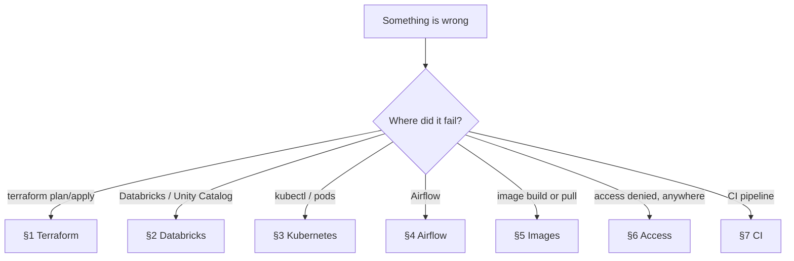
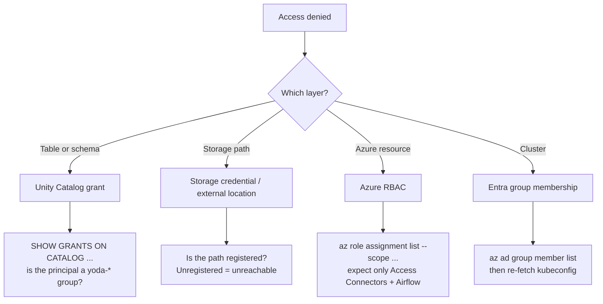

# Troubleshooting

Symptom-first diagnostics. You have an error or something is not working — start
here.

**This is not [RUNBOOKS.md](RUNBOOKS.md).** That document is entered from an
*alert* and answers "the platform told me something is wrong". This one is
entered from a *symptom* and answers "I am trying to do something and it will
not work".

Most entries below are real failures encountered building this platform; the
root causes are recorded in [BUILD-LOG.md](BUILD-LOG.md).

---

## Start here



**Before anything else**, three commands rule out most of the boring causes:

```bash
az account show --query "{sub:name, user:user.name}" -o table   # right subscription?
./scripts/bash/check-quota.sh sandbox                           # quota available?
make plan ENV=sandbox                                           # drift, or genuinely broken?
```

---

## 1. Terraform

### `Invalid count argument` — value not known until apply

```
The "count" value depends on resource attributes that cannot be determined
until apply... To work around this, use the -target argument
```

**Do not use `-target`.** It is the suggestion in the error and it is the wrong
fix — it skips dependency checking and has to be remembered forever.

**Cause.** `count` conditioned on something another module produces, e.g.
`var.log_analytics_workspace_id != ""`. At plan time that value is unknown.

**Fix.** A plan-time boolean the caller already knows:

```hcl
variable "enable_diagnostics" { type = bool, default = true }
resource "..." { count = var.enable_diagnostics ? 1 : 0 }
```

This repository uses `enable_diagnostics`, `enable_acr_pull`,
`enable_key_vault_grant` for exactly this reason.

### `Provider produced inconsistent final plan`

Usually an attribute where the API returns a different form than was sent. The
known case here is Databricks `isolation_mode` — see §2.

### Storage: `ip_rules must start with IPV4 address and/or slash (0-30)`

**Cause.** The storage firewall rejects `/32`. It is the only Azure firewall
that does — Key Vault, ACR and AKS all accept it.

**Fix.** Already handled in `modules/data-lake` (`local.storage_ip_rules` strips
the suffix). Write CIDR at the call site; do not special-case it per caller.

### `MissingLastAccessTimeBasedTrackingPolicy`

**Cause.** A lifecycle rule tiers on last access, but tracking is not enabled.

**Fix.** `last_access_time_enabled = true` in `blob_properties` — already set.
If you add a `..._since_last_access_time_...` rule to another account, it needs
the same.

### `Managed cluster is on version X, which is only available for Long-Term Support`

**Cause.** The AKS version aged out of `KubernetesOfficial` into
`AKSLongTermSupport`. The error names the version, so it reads as "version does
not exist".

**Fix.**

```bash
az aks get-versions --location swedencentral \
  --query "values[?capabilities.supportPlan[0]=='KubernetesOfficial'].version" -o tsv
```

Pin one of those in `modules/aks-platform/variables.tf`.

### State is locked

```bash
# Confirm nothing is genuinely running first — a forced unlock during an apply
# corrupts state far worse than waiting does.
ps aux | grep [t]erraform
terraform force-unlock <LOCK_ID>    # only after confirming
```

### Apply reported success but resources are missing

**Cause.** The exit code was masked by a pipe — `terraform apply | tail` returns
`tail`'s status.

**Fix.** `set -o pipefail`, or capture to a file and grep for `Error:`. This
cost a full cycle during the build.

---

## 2. Databricks and Unity Catalog

### `overlaps with an existing external location`

**Cause.** External locations are **metastore-scoped and may not overlap**. Two
domains both tried to register a container root.

**Fix.** Each domain owns a prefix, never the container:

```
abfss://silver@lake/platform/      ✓
abfss://silver@lake/logistics/     ✓
abfss://silver@lake/               ✗ claims the whole layer
```

Had it succeeded it would have been worse than the error — both domains would
hold the entire layer.

### `cannot update storage credential ... use force option`

**Cause.** Databricks spells `isolation_mode` two ways, and the API returns the
long form:

| Object | Accepted value |
|---|---|
| Storage credential, external location | `ISOLATION_MODE_ISOLATED` / `ISOLATION_MODE_OPEN` |
| Catalog | `ISOLATED` / `OPEN` |

Setting the short form on a credential creates a permanent diff, and updating a
credential with dependent locations then needs `force_update`.

**Fix.** Both are handled in `modules/unity-catalog`
(`local.credential_isolation_mode`, `force_update = true`).

### `Could not find principal with name yoda-...`

**Cause.** Entra groups do not exist in Databricks until **SCIM** synchronises
them into the *account*. Terraform can only name principals Databricks knows.

**Fix.** [RUNBOOKS.md](RUNBOOKS.md#scim-provisioning). Until SCIM is configured,
keep `enable_grants = false` — the gate exists to prevent a half-applied grant
model.

### No metastore assigned

```bash
./scripts/bash/check-metastore.sh sandbox
```

Azure auto-provisions one per region on first workspace creation. If absent,
create it once as an account admin at `accounts.azuredatabricks.net` — it is
account-scoped and cannot be done by a workspace provider
([ADR-007](DECISIONS.md#adr-007)).

### Catalog owned by a person, not a group

Expected while `enable_grants = false` — Databricks defaults ownership to the
creator. `make drift` reports it correctly. It clears when grants are applied.

### A classic cluster will not start — times out reaching the control plane

**Cause.** Azure retired default outbound access for VNets created after
2025-09-30. Sandbox has no NAT gateway because serverless needs none.

**Fix.** `enable_nat_gateway = true` (~EUR 32/month). Subnets, NSG rules and the
public IP already exist. See [ADR-004](DECISIONS.md#adr-004).

---

## 3. Kubernetes

### `kubectl` returns Forbidden

**Cause.** The cluster has `local_account_disabled = true` and Entra RBAC. There
is no admin kubeconfig; access comes from **group membership**.

**Fix.** Join the admin group, then re-fetch credentials:

```bash
GID=$(az ad group show --group yoda-platform-admins --query id -o tsv)
az ad group member add --group "$GID" --member-id "$(az ad signed-in-user show --query id -o tsv)"
make kubeconfig ENV=sandbox
```

Group membership can take a few minutes to reflect in a fresh token.

### Pod stuck `Pending`

```bash
kubectl describe pod -n <ns> <pod> | tail -20
```

| Message | Cause | Fix |
|---|---|---|
| `Insufficient cpu/memory` | Single 2 vCPU node is full | `make stop`/`start`, reduce requests, or accept the ceiling |
| `didn't match Pod's node affinity` | Node selector with no matching node | Remove the selector — there is one pool |
| `waiting for first consumer` | PVC not yet bound | Normal; binds when the pod schedules |
| Two ReplicaSets both want a pod | Rolling update cannot fit | See below |

### Deployment never converges — old and new pods both present

**Cause.** A rolling update needs both pods scheduled simultaneously. A 2 vCPU
node has no room, so the new pod stays `Pending` until the Helm timeout while
the old one holds the resources.

**Fix.** `strategy: type: Recreate` (Deployments), `updateStrategy: type:
OnDelete` (StatefulSets) — already set in
`kubernetes/airflow/values-sandbox.yaml`. Same trade as `max_surge = "10%"` on
the node pool: brief downtime beats an upgrade that cannot run.

To clear a stuck roll:

```bash
kubectl delete rs -n airflow <old-replicaset>
```

### Pod rejected by Pod Security

```
violates PodSecurity "restricted:latest": ... must set securityContext...
```

**Cause.** The `airflow` namespace enforces `restricted`. Many upstream chart
containers do not comply.

**Fix.** Supply the context per component rather than relaxing the namespace —
`securityContexts.pod` needs `runAsNonRoot` and `seccompProfile:
{type: RuntimeDefault}`; containers need `allowPrivilegeEscalation: false` and
`capabilities.drop: [ALL]`. `monitoring` runs `privileged` only because
node-exporter genuinely needs host access.

### Everything fails with `serviceaccount "airflow" not found`

**Cause.** The Airflow chart has no *global* `serviceAccount` block, so
`create: true` at the top level does nothing.

**Fix.** The ServiceAccount is owned by
`kubernetes/airflow/serviceaccount.yaml` — it is the federated-credential
subject and belongs in the repo, not in chart defaults.

---

## 4. Airflow

### DAG does not appear

```bash
kubectl exec -n airflow deploy/airflow-scheduler -c scheduler -- \
  ls /opt/airflow/dags/
kubectl exec -n airflow deploy/airflow-scheduler -c scheduler -- \
  airflow dags list-import-errors
```

| Finding | Cause | Fix |
|---|---|---|
| Directory empty | Running a stale image | See §5 — pin by digest |
| File present, DAG absent | Import error | Read the errors above; `make dag-test` locally |
| Import error naming a provider | Provider missing from the image | Add to `docker/airflow/requirements.txt`, rebuild |

### Chart fails to render on a `config` value

```
executing "airflow/templates/NOTES.txt" at <.Values.config.logging.remote_logging>
```

**Cause.** Everything under `config` becomes `airflow.cfg` text and the chart
compares it as a string. An unquoted YAML boolean renders as `false` and fails
the comparison.

**Fix.** Quote them: `"True"` / `"False"`.

### Task pods never start / DAG runs queue forever

Two concurrent tasks is roughly the ceiling on a 2 vCPU node. If work is
queueing, check that operators are **deferrable** — a non-deferrable
`DatabricksSubmitRunOperator` holds a worker pod for the whole Databricks run
([ADR-014](DECISIONS.md#adr-014)).

### Postgres `ErrImagePull`

**Cause.** The chart's bundled Bitnami subchart pins a tag Bitnami withdrew.

**Fix.** Already replaced by `kubernetes/airflow/postgres.yaml` — the official
image, `restricted`-compliant, forty lines we control.

---

## 5. Images

### Build appears to hang for many minutes

**Cause.** The build context is the repository root and includes `.terraform/`
— roughly **2.9 GB** of provider binaries. Both build paths tar and upload the
whole context before the first layer.

**Fix.** `.dockerignore` at the root already excludes it. If you add a build,
confirm the context size first:

```bash
du -sh --exclude=.terraform --exclude=.git .
```

### `TasksOperationsNotAllowed`

**Cause.** ACR Tasks is not permitted on this subscription tier — and it
*queues* before rejecting, so it reads as a hang rather than an error.

**Fix.** `deploy-platform.sh` tries local Docker first for this reason. Build
locally, always for the cluster's architecture:

```bash
docker buildx build --platform linux/amd64 -f docker/airflow/Dockerfile --push -t <acr>/airflow:<tag> .
```

### Pod runs old code after a rebuild

**The one most likely to waste an afternoon.**

**Cause.** The image was pinned by *tag* with `pullPolicy: IfNotPresent`. A node
holding any image with that tag never re-pulls.

**Diagnose** — compare what the registry has against what is running:

```bash
az acr repository show --name <acr> --image airflow:2.10.5 --query digest -o tsv
kubectl get pod -n airflow -l component=scheduler \
  -o jsonpath='{.items[0].status.containerStatuses[0].imageID}'
```

Different digests confirm it.

**Fix.** Pin by digest — `images.airflow.digest` in the values, substituted by
the deploy script. A tag is a mutable pointer; the digest is what actually ran.

### `exec format error`

Built on Apple Silicon without `--platform linux/amd64`. The image pulls fine
and then crash-loops.

---

## 6. Access denied

Work outward from the narrowest scope.



**Expected role assignments on the lake** — anything else is drift:

| Principal | Role |
|---|---|
| Access Connector × 2 | Storage Blob Data Contributor |
| Airflow identity | Storage Blob Data Reader |
| `yoda-platform-admins` | Storage Blob Data Contributor (break-glass) |

A missing assignment is far more often a failed apply than an attack —
`make plan` will show it.

### Storage returns 403 from a laptop

The firewall denies by default and allows only the operator IP recorded at
`make tfvars` time. If your address changed, regenerate and re-apply:

```bash
make tfvars ENV=sandbox && make plan ENV=sandbox && make apply ENV=sandbox
```

---

## 7. CI

### Trivy fails on something the ignore file covers

**Cause.** `paths` in `.trivyignore.yaml` are relative to the **scan root**. The
scan runs `trivy config terraform/`, so a finding in
`terraform/modules/aks-platform/main.tf` is reported as
`modules/aks-platform/main.tf`.

A wrong path **parses fine, matches nothing, and still fails the build** —
silently. Verify with:

```bash
trivy config terraform/ --severity CRITICAL --ignorefile .trivyignore.yaml --exit-code 1
```

### Trivy flags a control that is present

Trivy evaluates modules statically, so a value arriving through a variable is
invisible to it. Prefer making the control *structurally impossible to omit* — a
required variable with a validation — over suppressing the finding. That is what
`api_server_authorized_ip_ranges` does.

### OIDC federation fails in GitHub Actions

The subject must match exactly:

```
repo:Mpurushotham/Azure-DataPlatform-management-usecase:environment:sandbox
```

Check `terraform/bootstrap/variables.tf` `github_repository`, and that the job
declares `permissions: id-token: write` and the right `environment:`.

### tflint reports unused declarations

Not cosmetic — an unused variable usually means a control that was designed and
never wired up. Remove it and record the gap, or implement it. Do not leave an
input implying a control that does not exist.

---

## Escalation

If nothing here fits:

1. `make plan ENV=sandbox` — is it drift or a genuine failure?
2. Azure Activity Log for the resource group — what did Azure actually reject?
3. [BUILD-LOG.md](BUILD-LOG.md) §4 — 18 failures with root causes
4. [RUNBOOKS.md](RUNBOOKS.md) if an alert is also firing
5. `make destroy` and rebuild — the environment is designed for it, and a clean
   rebuild takes under an hour
